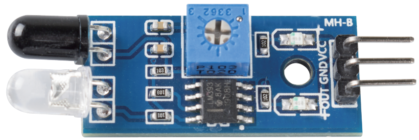

.. _cpn_avoid:

Μονάδα Αποφυγής Εμποδίων
===========================================

* **VCC**: Τροφοδοσία, 3.3 ~ 5V DC.
* **GND**: Γείωση
* **OUT**: Ακίδα σήματος, συνήθως υψηλής στάθμης, που γίνεται χαμηλή όταν ανιχνεύεται εμπόδιο.

Η μονάδα IR (υπερύθρων) Αποφυγής Εμποδίων έχει ισχυρή προσαρμοστικότητα στο φως του περιβάλλοντος και διαθέτει ένα ζευγάρι σωλήνων εκπομπής και λήψης υπέρυθρων.

Ο σωλήνας εκπομπής εκπέμπει σε συχνότητα υπερύθρων και όταν η κατευθυνόμενη ακτίνα ανίχνευσης συναντά ένα εμπόδιο, η υπέρυθρη ακτινοβολία λαμβάνεται από τον σωλήνα λήψης και αφού γίνει επεξεργασία από το κύκλώμα σύγκρισης, ανάβει η πράσινη ένδειξη και παράγεται σήμα χαμηλής στάθμης.

Η επιθυμητή απόσταση ανίχνευσης μπορεί να ρυθμιστεί με το ποτενσιόμετρο, μεταξύ 2-30εκ.

.. image:: img/IR_module.png
    :width: 600
    :align: center

**Example**

* :ref:`ar_avoid` (Έργο Arduino)
* :ref:`shooting` (Έργο Scratch)

