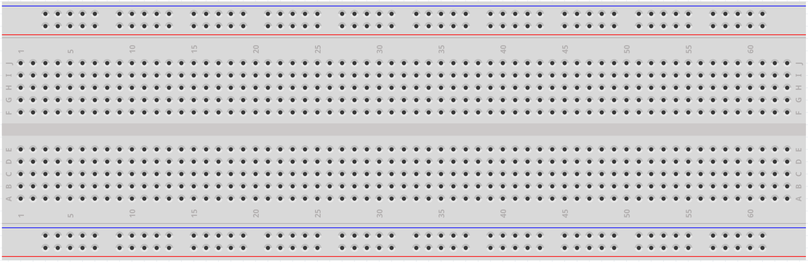

.. _cpn_breadboard:

Breadboard
==============

Το breadboard είναι μια κατασκευαστική βάση για τη δημιουργία πρωτότυπων ηλεκτρονικών κυκλωμάτων. Αρχικά η λέξη αναφερόταν κυριολεκτικά σε σανίδα ψωμιού, ένα κομμάτι ξύλου με λεία επιφάνεια που χρησιμοποιείται για τον τεμαχισμό του ψωμιού. Στη δεκαετία του 1970 έγινε διαθέσιμη η πλακέτα breadboard χωρίς συγκόλληση (γνωστή και ως plugboard, μια πλακέτα διάταξης τερματικού) και στις μέρες μας ο όρος «breadboard» χρησιμοποιείται συνήθως για να αναφερθεί σε αυτές.

Χρησιμοποιείται για τη γρήγορη κατασκευή και δοκιμή κυκλωμάτων κατά τη διάρκεια του σχεδιασμού τους. Και έχει πολλές τρυπίτσες στις οποίες εισάγονται  εξαρτήματα που αναφέρονται παραπάνω, όπως ICs και αντιστάσεις, καθώς και καλώδια βραχυκυκλωτήρα. Το breadboard σάς επιτρέπει να συνδέετε και να αφαιρείτε εξαρτήματα εύκολα.

Η εικόνα δείχνει την εσωτερική δομή ενός breadboard. Αν και αυτές οι τρυπίτσες στο breadboard φαίνεται να είναι ανεξάρτητες η μία από την άλλη, στην πραγματικότητα συνδέονται μεταξύ τους μέσω μεταλλικών λωρίδων εσωτερικά.

.. image:: img/breadboard_internal.png
    :width: 600

Αν θέλετε να μάθετε περισσότερα για το breadboard, ανατρέξτε στο: `How to Use a Breadboard - Science Buddies <https://www.sciencebuddies.org/science-fair-projects/references/how-to-use-a-breadboard#pth-smd>`_

