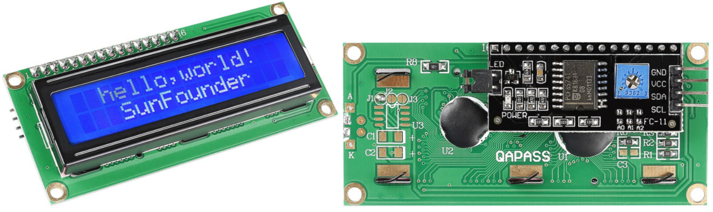
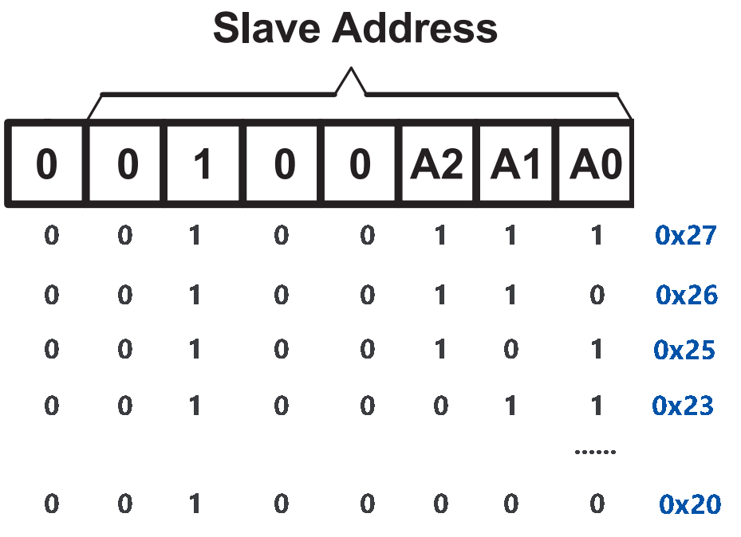

.. _cpn_i2c_lcd1602:

I2C LCD1602
==============

* **GND**: Γείωση
* **VCC**: Παροχή τάσης, 5V.
* **SDA**: Σειριακή γραμμή δεδομένων. Συνδέστε στο VCC μέσω μιας ανορθωτικής αντίστασης.
* **SCL**: Σειριακή γραμμη ρολογιού . Συνδέστε στο VCC μέσω μιας ανορθωτικής αντίστασης.

Όπως όλοι γνωρίζουμε, αν και οι LCD και ορισμένες άλλες οθόνες εμπλουτίζουν σημαντικά την αλληλεπίδραση ανθρώπου-μηχανής, μοιράζονται μια κοινή αδυναμία. Όταν συνδέονται με κάποιον ελεγκτή, καταλαμβάνουν πολλές εισόδους/εξόδους του και μπορεί ο ελεγκτής να μην διαθέτει τόσες πολλές εξωτερικές θύρες. Επίσης, περιορίζει άλλες λειτουργίες του ελεγκτή.

Η οθόνη LCD1602 με τη μονάδα I2C που διαθέτει, έχει αναπτυχθεί για να λύσει αυτό το πρόβλημα. Η μονάδα I2C διαθέτει ένα ενσωματωμένο τσιπ PCF8574 I2C που μετατρέπει σειριακά δεδομένα I2C σε παράλληλα δεδομένα για την οθόνη LCD.        

* `PCF8574 Φύλλο δεδομένων <https://www.ti.com/lit/ds/symlink/pcf8574.pdf?ts=1627006546204&ref_url=https%253A%252F%252Fwww.google.com%252F>`_

**Διεύθυνση I2C**

Η προεπιλεγμένη διεύθυνση είναι συνήθως η 0x27, αν και σε μερικές περιπτώσεις μπορεί να είναι η 0x3F.

Παίρνοντας ως παράδειγμα την προεπιλεγμένη διεύθυνση 0x27, η διεύθυνση της συσκευής μπορεί να τροποποιηθεί βραχυκυκλώνοντας τα pads A0/A1/A2; στην προεπιλεγμένη κατάσταση, το A0/A1/A2 είναι 1, και εάν το pad είναι βραχυκυκλωμένο, το A0/A1/A2 είναι 0.

**Οπίσθιος φωτισμός/Αντίθεση**

Ο οπίσθιος φωτισμός μπορεί να ενεργοποιηθεί με το κάλυμμα βραχυκυκλωτήρα, αποσυνδέστε το κάλυμμα βραχυκυκλωτήρα για να απενεργοποιήσετε τον οπίσθιο φωτισμό. Το μπλε ποτενσιόμετρο στο πίσω μέρος

.. image:: img/back_lcd1602.jpg

* **Shorting Cap**: Ο οπίσθιος φωτισμός μπορεί να ενεργοποιηθεί από αυτό το κάλυμμα, αφαιρέστε αυτό το κάλυμμα για να απενεργοποιήσετε τον οπίσθιο φωτισμό.
* **Ποτενσιόμετρο**: Χρησιμοποιείται για τη ρύθμιση της αντίθεσης (της ευκρίνειας του εμφανιζόμενου κειμένου), η οποία αυξάνεται κατά τη φορά των δεικτών του ρολογιού και μειώνεται κατά τη φορά των δεικτών του ρολογιού.

**Παραδείγματα**

* :ref:`ar_lcd1602` (Έργο Arduino)
* :ref:`ar_access_system` (Έργο Arduino)
* :ref:`ar_guess_number` (Έργο Arduino)
* :ref:`ar_overheat_monitor` (Έργο Arduino)
* :ref:`lcd1602` (Έργο Scratch)
