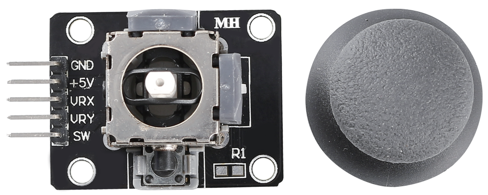

.. _cpn_joystick:

Μονάδα Joystick 
=======================

Η βασική ιδέα ενός joystick είναι να μεταφράσει την κίνηση ενός μοχλού σε ηλεκτρονικές πληροφορίες που μπορεί να επεξεργαστεί ο υπολογιστής.

Για να επικοινωνήσει ένα πλήρες εύρος κίνησης στον υπολογιστή, το joystick πρέπει να μετρήσει τη θέση του μοχλού σε δύο άξονες – τον άξονα Χ (από αριστερά προς τα δεξιά) και τον άξονα Υ (από πάνω προς τα κάτω). Όπως και στη βασική γεωμετρία, οι συντεταγμένες XY εντοπίζουν ακριβώς τη θέση του μοχλού.

Για τον προσδιορισμό της θέσης του μοχλού, το σύστημα ελέγχου του joystick απλώς παρακολουθεί τη θέση σε κάθε άξονα. Ο συμβατικός σχεδιασμός αναλογικού joystick το κάνει αυτό με δύο ποτενσιόμετρα ή μεταβλητές αντιστάσεις.

Το joystick έχει επίσης μια ψηφιακή είσοδο που ενεργοποιείται όταν πατάτε το joystick προς τα κάτω.

.. image:: img/joystick318.png
    :align: center
    :width: 600
	
**Παραδε**

* :ref:`ar_joystick` (Arduino Project)
* :ref:`star_crossed` (Scratch Project)
* :ref:`dragon` (Scratch Project)
