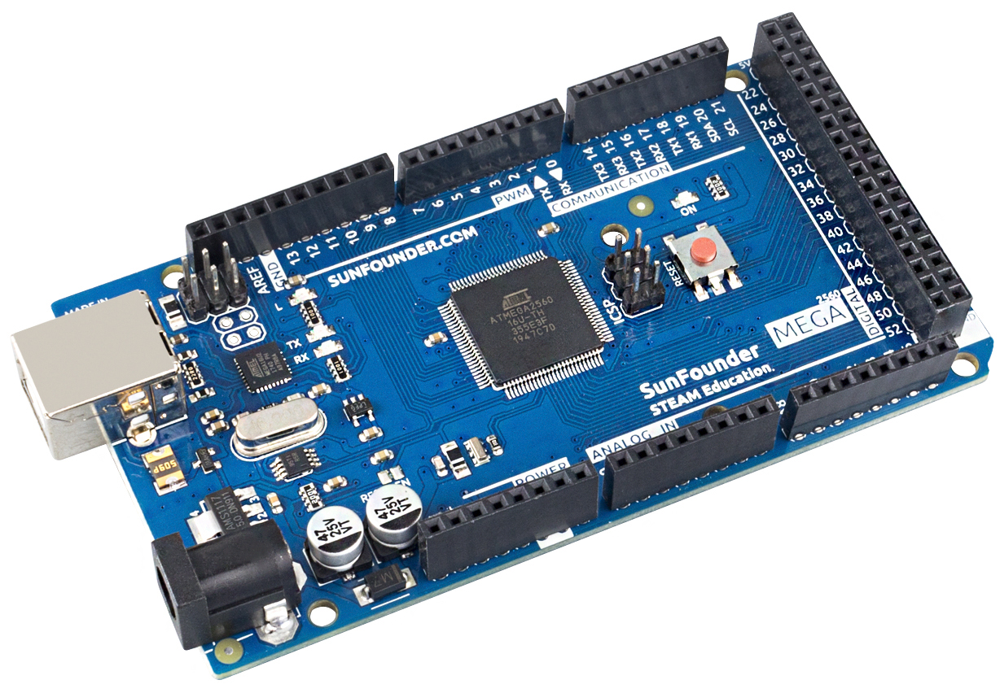
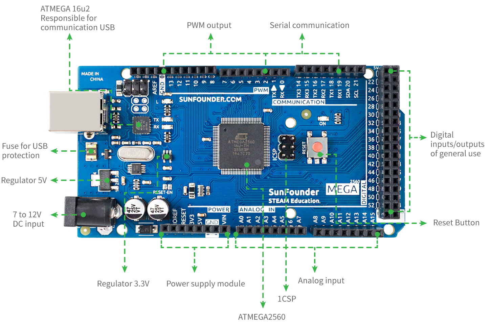

.. _cpn_mega2560:

Πλακέτα SunFounder Mega 
==============================

.. note::

    Η πλακέτα SunFounder Mega είναι μια κύρια πλακέτα με σχεδόν τις ίδιες λειτουργίες με το `Arduino Mega 2560 Rev3 <https://store-usa.arduino.cc/products/arduino-mega-2560-rev3?selectedStore=us>`_, και οι δύο πλακέτες μπορούν να χρησιμοποιηθούν εναλλακτικά.

Η SunFounder Mega είναι μια πλακέτα μικροελεγκτή που βασίζεται στο ATmega2560 (`datasheet <http://ww1.microchip.com/downloads/en/DeviceDoc/ATmega640-1280-1281-2560-2561-Datasheet-DS40002211A.pdf>`_). Διαθέτει 54 ψηφιακές ακίδες εισόδου/εξόδου (από τις οποίες οι 15 μπορούν να χρησιμοποιηθούν ως έξοδοι PWM), 16 αναλογικές εισόδους, 4 UART (σειριακές θύρες υλικού), έναν κρυσταλλικό ταλαντωτή 16 MHz, μια σύνδεση USB, μια υποδοχή τροφοδοσίας, μια κεφαλίδα ICSP, και ένα κουμπί επαναφοράς. Περιλαμβάνει όλα όσα χρειάζονται για την υποστήριξη του μικροελεγκτή. Απλά συνδέστε τη σε έναν υπολογιστή με καλώδιο USB ή τροφοδοτήστε τη με έναν προσαρμογέα AC-σε-DC ή μπαταρία για να ξεκινήσετε. Η πλακέτα SunFounder Mega είναι συμβατή με τα περισσότερα περιβλήματα (shields) που έχουν σχεδιαστεί για το Uno και τις παλαιότερες πλακέτες Duemilanove ή Diecimila.

**Τεχνικές παράμετροι**

* ΜΙΚΡΟΕΛΕΓΚΤΗΣ: ATmega2560
* ΤΑΣΗ ΛΕΙΤΟΥΡΓΙΑΣ: 5V
* ΤΑΣΗ ΕΙΣΟΔΟΥ (ΣΥΝΙΣΤΩΜΕΝΗ): 7-12V
* ΤΑΣΗ ΕΙΣΟΔΟΥ (ΟΡΙΑ): 6-20V
* ΨΗΦΙΑΚΕΣ I/O ΑΚΙΔΕΣ (PINS): 54 (0-53, εκ των οποίων 15 παρέχουν έξοδο PWM(2-13, 44-46))
* ΑΝΑΛΟΓΙΚΕΣ ΑΚΙΔΕΣ ΕΙΣΟΔΟΥ: 16 (A0-A15)
* ΣΥΝΕΧΕΣ ΡΕΥΜΑ ΑΝΑ ΑΚΙΔΑ I/O: 20 mA
* ΣΥΝΕΧΕΣ ΡΕΥΜΑ ΓΙΑ ΤΙΣ ΑΚΙΔΕΣ 3.3V: 50 mA
* ΜΝΗΜΗ FLASH: 256 KB εκ των οποίων τα 8 KB χρησιμοποιούνται από τον bootloader
* SRAM: 8 KB
* EEPROM: 4 KB
* ΣΥΧΝΟΤΗΤΑ ΡΟΛΟΓΙΟΥ: 16 MHz
* LED_BUILTIN: 13
* ΜΗΚΟΣ: 101.52 χλστ
* ΠΛΑΤΟΣ: 53.3 χλστ
* ΒΑΡΟΣ: 37 γρ
* Θύρες I2C: A4(SDA), A5(SCL); 20(SDA), 21(SCL)

**Επί πλέον**

* `Arduino IDE <https://www.arduino.cc/en/software>`_
* `Αναφορά γλώσσας προγραμματισμού Arduino <https://www.arduino.cc/reference/en/>`_
* :ref:`Install and Introduce Arduino IDE`
* `ATmega2560 Datasheet <http://ww1.microchip.com/downloads/en/DeviceDoc/ATmega640-1280-1281-2560-2561-Datasheet-DS40002211A.pdf>`_
