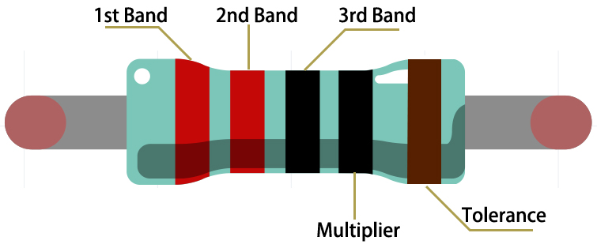

.. _cpn_resistor:

Αντίσταση
============

Η αντίσταση είναι ένα ηλεκτρολογικό/ηλεκτρονικό στοιχείο που μπορεί να περιορίσει το ρεύμα ενός κυκλώματος. Μια σταθερή αντίσταση είναι ένα είδος αντίστασης της οποίας η τιμή δεν μπορεί να αλλάξει, ενώ, αντίθετα, αυτή ενός ποτενσιόμετρου ή μιας μεταβλητής αντίστασης μπορεί να ρυθμιστεί.

Υπάρχουν γενικά δύο σύμβολα στη σχεδίαση ηλεκτρικών κυκλωμάτων που δηλώνουν την αντίσταση και κανονικά, η τιμή της αντίστασης συνοδεύει τα σύμβολα αυτά. Έτσι, κάθε ένα από τα παρακάτω σύμβολα σε ένα κύκλωμα, σημαίνει αντίσταση.

.. image:: img/resistor_symbol.png
    :width: 400

Το **Ω** στα σύμβολα παραπάνω είναι η μονάδα μέτρησης της αντίστασης και τα πολλαπλάσια αυτής της μονάδας περιλαμβάνουν τα KΩ, MΩ, κ.λ.π. 
Η συσχέτιση μεταξύ τους είναι η εξής: 1 MΩ=1000 KΩ, 1 KΩ = 1000 Ω. Κανονικά, η τιμή της αντίστασης αναγράφεται πάνω της. 

Όταν χρησιμοποιούμε μια αντίσταση, πρέπει πρώτα να ξέρουμε την τιμή της. Υπάρχουν δύο μέθοδοι για να τη μάθουμε: μπορούμε να παρατηρήσουμε τις ζώνες πάνω στην αντίσταση ή να χρησιμοποιήσουμε ένα πολύμετρο για να μετρήσουμε την τιμή της. Συνιστάται να χρησιμοποιήσετε την πρώτη μέθοδο καθώς είναι πιο βολική και πιο γρήγορη.

.. image:: img/resistance_card.jpg

Όπως φαίνεται στην κάρτα, κάθε χρώμα αντιπροσωπεύει έναν αριθμό. 

.. list-table::

   * - Black
     - Brown
     - Red
     - Orange
     - Yellow
     - Green
     - Blue
     - Violet
     - Grey
     - White
     - Gold
     - Silver
   * - 0
     - 1
     - 2
     - 3
     - 4
     - 5
     - 6
     - 7
     - 8
     - 9
     - 0.1
     - 0.01

The 4- and 5-band resistors are frequently used, on which there are 4 and 5 chromatic bands. 

Normally, when you get a resistor, you may find it hard to decide which end to start for reading the color. 
The tip is that the gap between the 4th and 5th band will be comparatively larger.

Therefore, you can observe the gap between the two chromatic bands at one end of the resistor; 
if it's larger than any other band gaps, then you can read from the opposite side. 

Let’s see how to read the resistance value of a 5-band resistor as shown below.

So for this resistor, the resistance should be read from left to right. 
The value should be in this format: 1st Band 2nd Band 3rd Band x 10^Multiplier (Ω) and the permissible error is ±Tolerance%. 
So the resistance value of this resistor is 2(red) 2(red) 0(black) x 10^0(black) Ω = 220 Ω, 
and the permissible error is ± 1% (brown). 

.. list-table::Common resistor color band
    :header-rows: 1

    * - Resistor 
      - Color Band  
    * - 10Ω   
      - brown black black silver brown
    * - 100Ω   
      - brown black black black brown
    * - 220Ω 
      - red red black black brown
    * - 330Ω 
      - orange orange black black brown
    * - 1kΩ 
      - brown black black brown brown
    * - 2kΩ 
      - red black black brown brown
    * - 5.1kΩ 
      - green brown black brown brown
    * - 10kΩ 
      - brown black black red brown 
    * - 100kΩ 
      - brown black black orange brown 
    * - 1MΩ 
      - brown black black green brown 

You can learn more about resistor from Wiki: `Resistor - Wikipedia <https://en.wikipedia.org/wiki/Resistor>`_.
