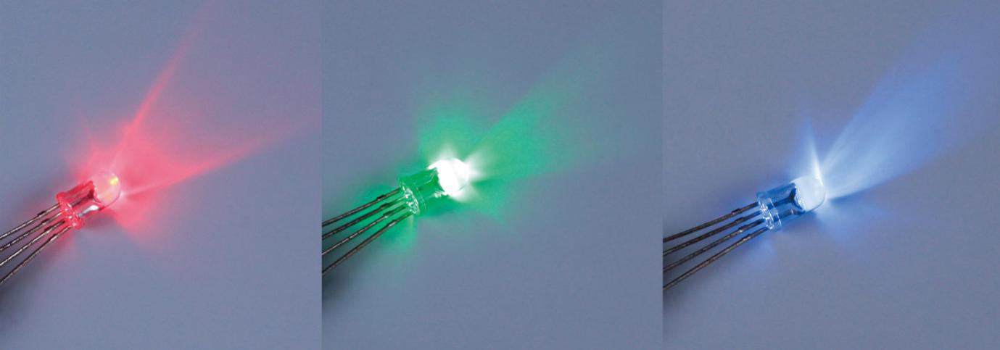
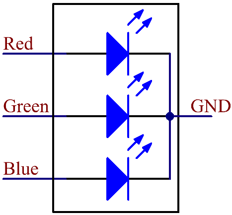
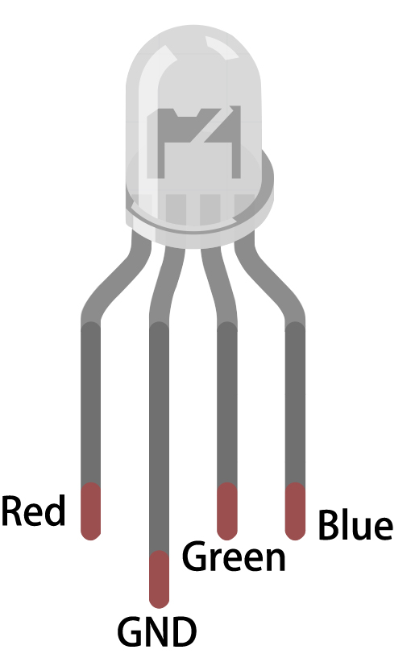

.. _cpn_rgb:

RGB LED
=================

.. image:: img/rgb_led.png
    :width: 100
    
Τα RGB LED εκπέμπουν φως σε διάφορα χρώματα. Ένα RGB LED εμπεριέχει τρία LED, κόκκινου, πράσινου και μπλε σε ένα διαφανές ή ημιδιαφανές πλαστικό κέλυφος. Μπορεί να εμφανίζει διάφορα χρώματα αλλάζοντας την τάση εισόδου των τριών ακίδων του και υπερθέτοντας τα τρία βασικά χρώματα, με τρόπο που, σύμφωνα με τη στατιστική, μπορεί να δημιουργήσει 16.777.216 διαφορετικά χρώματα.

Τα RGB LEDs συναντώνται σε δύο μορφές: με κοινή κάθοδο και με κοινή άνοδο. Σε αυτό το κιτ χρησιμοποιείται η πρώτη μορφή. Η **κοινή κάθοδος** ή CC, σημαίνει ότι συνδέονται οι κάθόδοι των τριών LED. Αφού συνδέσετε τις τρεις ακίδες και το GND στη γείωση, η λυχνία LED θα ανάψει στο αντίστοιχο χρώμα.

Το σύμβολο του κυκλώματος ενός RGB LED φαίνεται στο παρακάτω σχήμα.

Ένα RGB LED έχει 4 ακίδες: η μεγαλύτερη σε μηκος είναι η GND ενώ οι άλλες αντιστοιχούν στα χρώματα κόκκινο, πράσινο και μπλε. Αγγίξτε το πλαστικό κέλυφος του LED και θα βρείτε ένα κόψιμο. Η ακίδα που βρίσκεται πλησιέστερα στην τομή είναι η πρώτη ακίδα, η οποία σημειώνεται ως Κόκκινο (Red) και μετά, ακολουθούν με τη σειρά, τα GND, Πράσινο (Green) και Μπλε (Blue).

**Παραδείγματα**

* :ref:`ar_rgb` (Έργο Arduino)
* :ref:`ar_overheat_monitor` (Έργο Arduino)
