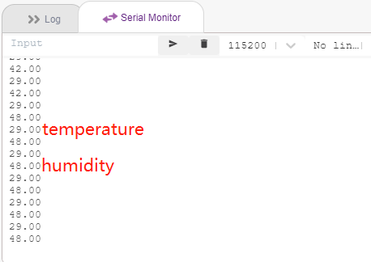
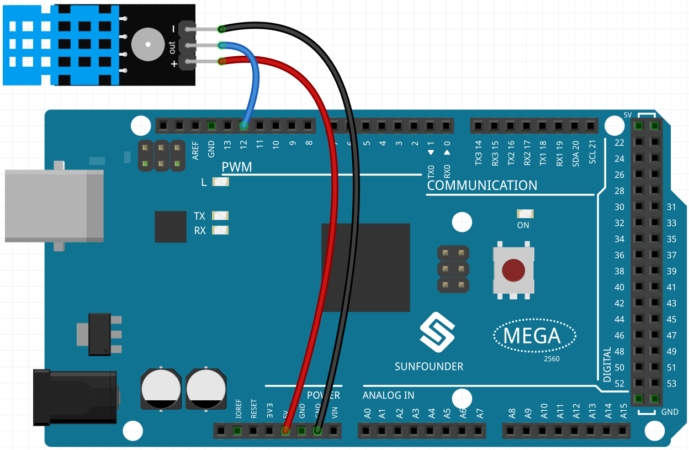
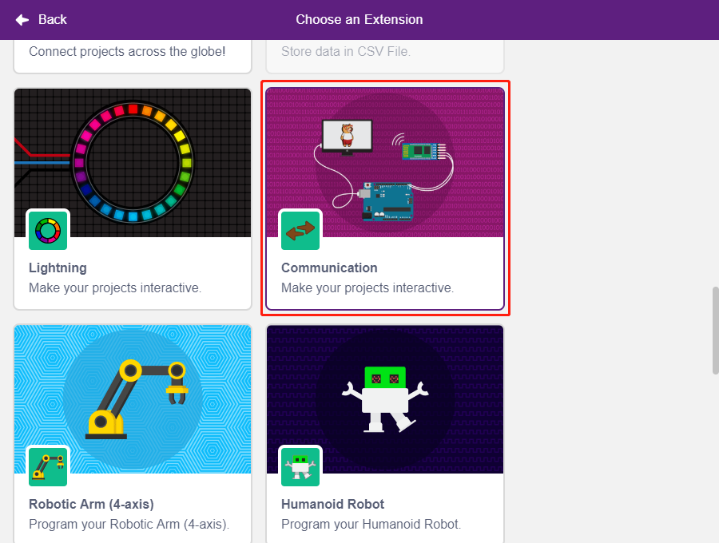
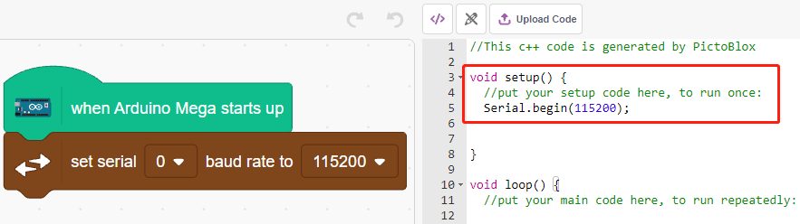
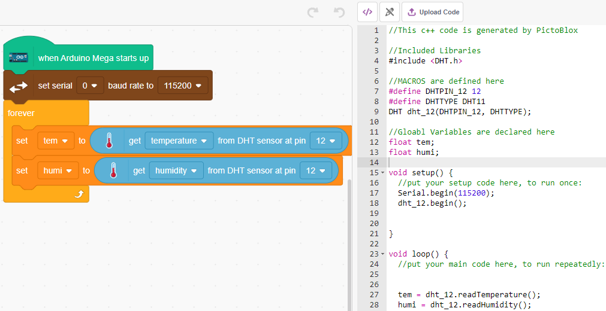
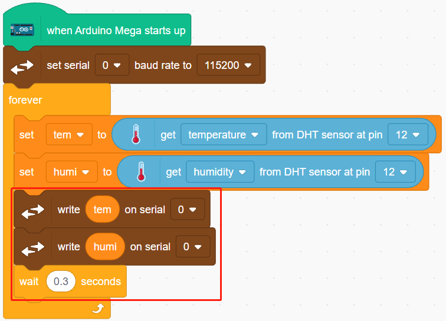
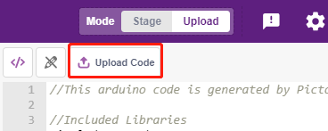

.. _humiture:

2.10 Διαβάστε τη Θερμοκρασία και την Υγρασία
=================================================

Τα προηγούμενα έργα χρησιμοποιούσαν τη λειτουργία Stage, αλλά ορισμένες δυνατότητες είναι διαθέσιμες μόνο σε λειτουργία Upload, όπως αυτή της σειριακής επικοινωνίας. Σε αυτό το έργο, θα εκτυπώσουμε τη θερμοκρασία και την υγρασία που καταγράφει ο DHT11 χρησιμοποιώντας τη σειριακή οθόνη σε :ref:`Upload Mode`.

Θα μάθετε
---------------------

- Να λαμβάνετε τη θερμοκρασία και την υγρασία από τη μονάδα DHT11
- Τη σειριακή οθόνη για το :ref:`Upload Mode`
- Την προσθήκη επεκτάσεων

Κατασκευάστε το κύκλωμα
-----------------------

Ο ψηφιακός αισθητήρας θερμοκρασίας και υγρασίας DHT11 είναι ένας σύνθετος αισθητήρας που διαθέτει μια βαθμονομημένη έξοδο ψηφιακού σήματος θερμοκρασίας και υγρασίας.

Κατασκευάστε το κύκλωμα σύμφωνα με το παρακάτω διάγραμμα.

* :ref:`cpn_breadboard`
* :ref:`cpn_humiture` 

Προγραμματισμός
------------------

**1. Προσθήκη επεκτάσεων**

Μεταβείτε στη λειτουργία **Upload**, κάντε κλικ στο κουμπί **Add Extension** στην κάτω αριστερή γωνία και, στη συνέχεια, επιλέξτε **Communication** για να προσθέσετε την επέκταση και θα τη δείτε να εμφανίζεται στο τέλος της περιοχής της παλέτας.

**2. Αρχικοποίηση του Arduino Mega και της Σειριακής Οθόνης**

Σε λειτουργία **Upload**, εκκινήστε το Arduino Mega και, στη συνέχεια, ορίστε τον ρυθμό baud της σειριακής θύρας.

* [when Arduino Starts up]: Σε λειτουργία **Upload**, εκκινήστε το Arduino Mega.
* [set serial baud rate to]: Από την παλέτα **Communications**, χρησιμοποιείται για τον ορισμό του ρυθμού baud της σειριακής θύρας 0, η προεπιλογή είναι 115200. Εάν χρησιμοποιείτε το Mega2560, τότε μπορείτε να επιλέξετε να ορίσετε το ρυθμό baud στις σειριακές θύρες 0~3.

**3. Διαβάστε τη θερμοκρασία και την υγρασία**

Δημιουργήστε 2 μεταβλητές **tem** και **humi** για να αποθηκεύσετε τη θερμοκρασία και την υγρασία αντίστοιχα, ο κώδικας Arduino θα εμφανιστεί στη δεξιά πλευρά ενώ σύρετε και αποθέτετε τα μπλοκ.

**4. Εκτυπώστε τα στη Σειριακή Οθόνη**

Γράψτε τη θερμοκρασία και την υγρασία που διαβάσατε στη σειριακή οθόνη. Για να αποφύγετε τη γρήγορη μεταφορά που μπορεί να προκαλέσει εμπλοκή στο PictoBlox, χρησιμοποιήστε το μπλοκ [wait seconds], για να προσθέσετε κάποιο χρονικό διάστημα μ την επόμενη εκτύπωση.

**5. Μεταφόρτωση κώδικα**

Σε αντίθεση με τη λειτουργία **Stage**, ο κώδικας στη λειτουργία **Upload** πρέπει να μεταφορτωθεί στην πλακέτα Arduino, χρησιμοποιώντας το κουμπί **Upload Code**, για να δείτε το αποτέλεσμα. Αυτό σας επιτρέπει επίσης να αποσυνδέσετε το καλώδιο USB και να συνεχίσετε να τρέχετε το πρόγραμμα.

**6. Ενεργοποίηση σειριακής οθόνης**

Ανοίξτε τώρα το **Serial Monitor** για να δείτε τη θερμοκρασία και την υγρασία.

