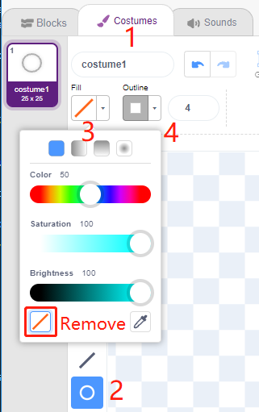
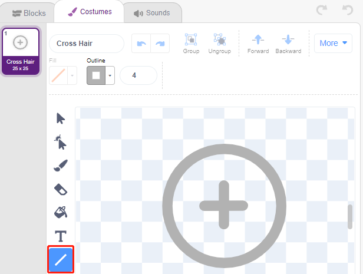
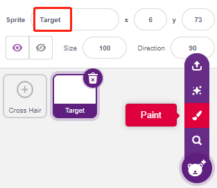
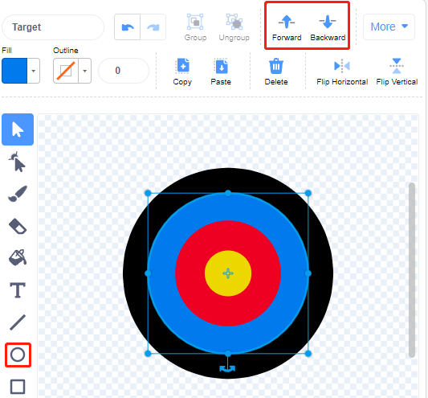
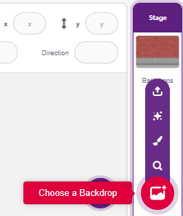
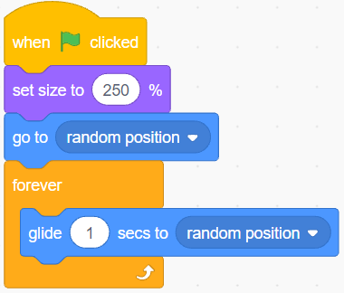
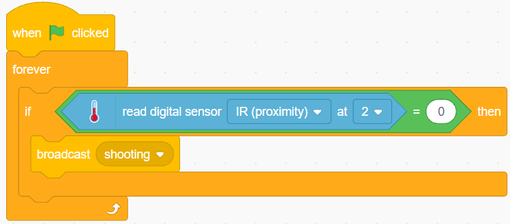
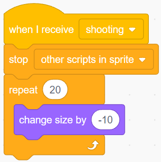

.. _shooting:

2.14 ΠΑΙΧΝΙΔΙ - Σκοποβολή
====================================

Έχετε δει παιχνίδια σκοποβολής στην τηλεόραση; Όσο πιο κοντά ένας διαγωνιζόμενος εκτοξεύει μια σφαίρα προς το κέντρο του στόχου, τόσο υψηλότερο είναι το σκορ του.

Σε ό,τι ακολουθεί θα φτιάξουμε ένα παιχνίδι σκοποβολής σε Scratch. Στο παιχνίδι, θα πρέπει να προσπαθήσετε να φέρετε το στρόχαστρο όσο το δυνατόν πιο κοντά στο κέντρο του στόχου για να πάρετε υψηλότερο σκορ.

Κάντε κλικ στην πράσινη σημαία για να ξεκινήσετε και χρησιμοποιήστε τη μονάδα Αποφυγής Εμποδίων για να πυροβολήσετε (μια σφαίρα κάθε φορά).

.. image:: img/14_shooting.png

Θα μάθετε
---------------------

- Πώς δουλεύει η μονάδα Αποφυγής Εμποδίων και το εύρος γωνίας
- Να ζωγραφίζετε διαφορετικές μορφές
- Για τα χρώματα επαφής

Κατασκευάστε το κύκλωμα
-----------------------

Η μονάδα Αποφυγής Εμποδίων είναι ένας αισθητήρας εγγύτητας υπερύθρων με ρυθμιζόμενη απόσταση, του οποίου, συνήθως, η έξοδος είναι υψηλή και γίνεται χαμηλή όταν ανιχνεύεται ένα εμπόδιο.

Κατασκευάστε τώρα το κύκλωμα σύμφωνα με το παρακάτω διάγραμμα.

.. image:: img/circuit/avoid_circuit.png

* :ref:`cpn_breadboard`
* :ref:`cpn_avoid` 

Προγραμματισμός
------------------

**1. Σχεδιάστε τη μορφή του Στόχαστρου**

Διαγράψτε την προεπιλεγμένη μορφή, επιλέξτε το κουμπί **Sprite** και κάντε κλικ στο **Paint**. Ονομάστε **Crosshair** την κενή μορφή **Sprite1** που θα εμφανιστεί.

.. image:: img/14_shooting0.png

Μεταβείτε στη σελίδα **Ενδυμασίες** της μορφής **Crosshair**. Κάντε κλικ στο εργαλείο **Circle**, αφαιρέστε το χρώμα γεμίσματος και ορίστε το χρώμα και το πλάτος του περιγράμματος.

Τώρα σχεδιάστε έναν κύκλο με το εργαλείο **Circle**. Μετά το σχεδιασμό του, μπορείτε να κάνετε κλικ στο εργαλείο **Select** και να μετακινήσετε τον κύκλο έτσι ώστε το κέντρο του να ευθυγραμμιστεί με το κέντρο του καμβά.

.. image:: img/14_shooting03.png

Χρησιμοποιώντας το εργαλείο **Line**, σχεδιάστε έναν σταυρό μέσα στον κύκλο.

**Σχεδιάστε τη μορφή του Στόχου**

Δημιουργήστε μια νέα μορφή με όνομα **Target**.

Μεταβείτε στη σελίδα **Ενδυμασίες** της μορφής **Target**, κάντε κλικ στο εργαλείο **Circle** , επιλέξτε ένα χρώμα γεμίσματος, αφαιρέστε το Περίγραμμα και σχεδιάστε έναν μεγάλο κύκλο.

.. image:: img/14_shooting05.png

Χρησιμοποιήστε την ίδια μέθοδο για να σχεδιάσετε επιπλέον κύκλους, τον καθένα με διαφορετικό χρώμα, χρησιμοποιώντας αν χρειαστεί τα εργαλεία **Forward** ή **Backbard** για να αλλάξετε τη θέση των επικαλυπτόμενων κύκλων. Σημειώστε ότι πρέπει επίσης να επιλέξετε το εργαλείο για να μετακινήσετε τους κύκλους, έτσι ώστε το κέντρο όλων των κύκλων και το κέντρο του καμβά να συμπίπτουν.

**3. Προσθέστε ένα Σκηνικό**

Προσθέστε ένα κατάλληλο σκηνικό που κατά προτίμηση δεν έχει πάρα πολλά χρώματα και δεν ταιριάζει με τα χρώματα της μορφής **Target**. Εδώ επέλεξα το σκηνικό **Wall1**.

**4. Γράψτε το σενάριο του Στόχαστρου**

Ορίστε την τυχαία θέση και το μέγεθος της μορφής **Crosshair** και αφήστε τη να κινηθεί τυχαία.

Όταν ένα χέρι τοποθετηθεί μπροστά από τη μονάδα Αποφυγής Εμποδίων, αυτή θα στείλει στην έξοδο ένα σήμα χαμηλής στάθμης ως σήμα μετάδοσης.

Όταν ληφθε το μήνυμα **shooting**, η μορφή σταματάει να κινείται και σιγά-σιγά συρρικνώνεται, προσομοιώνοντας έτσι το αποτέλεσμα του πυροβολισμού.

Χρησιμοποιήστε το μπλοκ [Touch color ()] για να προσδιορίσετε τη θέση της βολής.

.. image:: img/14_shooting7.png

Όταν η βολή είναι μέσα στον κίτρινο κύκλο, εμφανίζεται το "10".

.. image:: img/14_shooting8.png

Χρησιμοποιήστε την ίδια μέθοδο για να προσδιορίσετε τη θέση της βολής της σφαίρας. Εάν η θέση δεν έχει οριστεί στη μορφή **Target**, σημαίνει ότι η βολή είναι εκτός στόχου.

.. image:: img/14_shooting9.png
