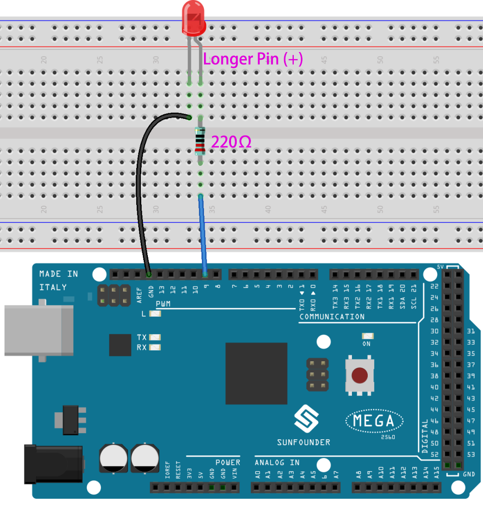
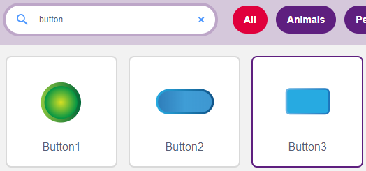
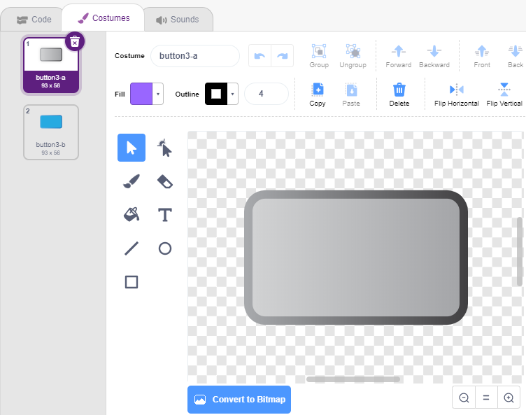
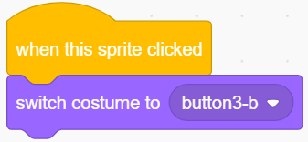
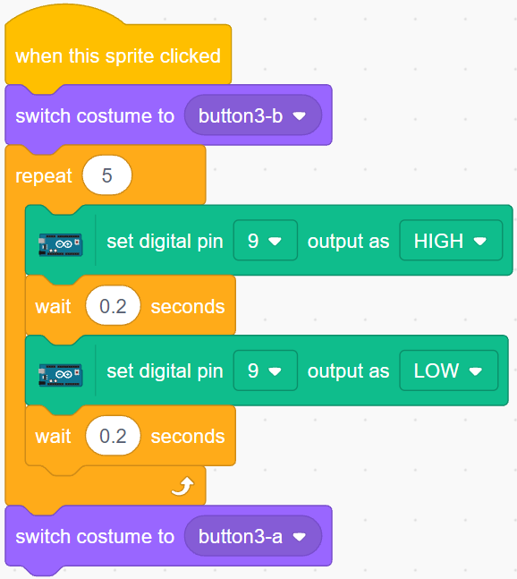

.. _table_lamp:

2.1 Επιτραπέζιο φωτιστικό
================

Εδώ, συνδέουμε ένα LED στο breadboard και έχουμε μια μορφή να ελέγχει το αναβοσβήσιμο αυτού του LED.

Όταν κάνετε κλικ στη μορφή Button στη σκηνή, το LED θα αναβοσβήνει 5 φορές και στη συνέχεια θα σταματάει.

.. image:: img/2_button.png

Θα μάθετε
---------------------

- για Breadboard, LED και Αντιστάσεις
- να κατασκευάζετε κυκλώματα σε breadboard
- να διαγράφετε και να επιλέγετε μορφές
- να εναλλάσετε ενδυμασίες
- να ορίζετε την εκτέλεση βρόχων για συγκεκριμένο αριθμό επαναλήψεων

Κατασκευάστε το κύκλωμα
-----------------------

Ακολουθήστε το παρακάτω διάγραμμα για να δημιουργήσετε το κύκλωμα στο breadboard.

Δεδομένου ότι η άνοδος του LED (η μεγαλύτερη ακίδα) συνδέεται με τον ακροδέκτη 9 μέσω μιας αντίστασης 220 Ω και η κάθοδος του LED είναι συνδεδεμένη με τη γείωση (GND), μπορείτε να ανάψετε το LED δίνοντας στον ακροδέκτη 9 υψηλό επίπεδο (τάσης).

* :ref:`cpn_breadboard`
* :ref:`cpn_led`
* :ref:`cpn_resistor`

Προγραμματισμός
------------------

Συνολικά, ο προγραμματισμός χωρίζεται σε 3 μέρη: στο πρώτο μέρος θα επιλέξετε την επιθυμητή μορφή, στο δεύτερο θα αλλάξετε την ενδυμασία της μορφής για να φαίνεται ότι κάποιος μπορεί να κάνει κλικ πάνω της και στο τρίτο μέρος θα κάνετε το LED να αναβοσβήνει.

**1. Επιλέξτε τη μορφή Button3**

Διαγράψτε την υπάρχουσα μορφή Tobi χρησιμοποιώντας το κουμπί Delete στην επάνω δεξιά γωνία και επιλέξτε ξανά μια μορφή με το κουμπί Choose a Sprite.

.. image:: img/2_tobi.png

Εδώ, επιλέγουμε τη μορφή **Button3**.

Κάντε κλικ στην καρτέλα Costumes στην επάνω δεξιά γωνία και θα δείτε ότι η μορφή Button3 έχει 2 ενδυμασίες. Η ενδυμασία button3-a θα εμφανίζεται όταν το κουμπί απελευθρώνεται και το button3-b όταν η μορφή πατιέται.

**2. Εναλλάξτε Ενδυμασίες**.

Όταν η μορφή κλικάρεται (Παλέτα **Events**), η ενδυμασία της θα αλλάζει στην **button3-b** (Παλέτα **looks**).

**3. Κάντε το LED να αναβοσβήσει 5 φορές**

Χρησιμοποιήστε το μπλοκ [Repeat] για να κάνετε το LED να αναβοσβήσει 5 φορές (κύκλος High(Υψηλό)-> LOW(Χαμηλό)), μην ξεχνώντας να αλλάξετε την ακίδα (pin) 13 στην ακίδα 9 και, τελικά, αλλάξτε την ενδυμασία σε **button3-a**.

* [Repeat 10]: Ορισμένος αριθμός επαναλήψεων βρόχου, μπορείτε να ορίσετε τον αριθμό επαναλήψεων μόνοι σας, από την παλέτα **Control**.

