.. _dragon:

2.22 ΠΑΙΧΝΙΔΙ - Kill Dragon
============================

Εδώ, χρησιμοποιούμε το joystick για να παίξουμε ένα παιχνίδι εξάλειψης δράκων.

Όταν κάνετε κλικ στην πράσινη σημαία, ο δράκος θα αιωρείται πάνω-κάτω στη δεξιά πλευρά και θα εκτοξεύει φλόγες κατά διαστήματα. Πρέπει να χρησιμοποιήσετε το joystick για να ελέγξετε την κίνηση του μαγικού ραβδιού και να εξαπολύσετε επιθέσεις με αστέρια εναντίον του δράκου, αποφεύγοντας τις φλόγες που εκτοξεύει και τελικά να τον νικήσετε.

.. image:: img/19_dragon.png

Κατασκευάστε το κύκλωμα
-----------------------

Το joystick είναι μια συσκευή εισόδου που αποτελείται από ένα μοχλό που περιστρέφεται σε μια βάση και αναφέρει τη γωνία ή την κατεύθυνσή του στη συσκευή που ελέγχει. Τα joysticks χρησιμοποιούνται συχνά για τον έλεγχο βιντεοπαιχνιδιών και ρομπότ.

Για να επικοινωνήσει ένα πλήρες εύρος κίνησης στον υπολογιστή, το joystick πρέπει να μετρήσει τη θέση του μοχλού σε δύο άξονες – τον άξονα Χ (από αριστερά προς τα δεξιά) και τον άξονα Υ (από πάνω προς τα κάτω).

Οι συντεταγμένες κίνησης του joystick φαίνονται στο παρακάτω σχήμα.

.. note::

    * Η συντεταγμένη x μετράει την κίνηση από αριστερά προς τα δεξιά, το εύρος τιμών της είναι 0-1023.
    * Η συντεταγμένη y μετράει την κίνηση από πάνω προς τα κάτω, το εύρος τιμών της είναι 0-1023.
    
    
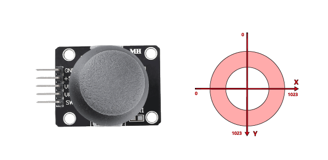

Κατασκευάστε τώρα το κύκλωμα σύμφωνα με το παρακάτω διάγραμμα.

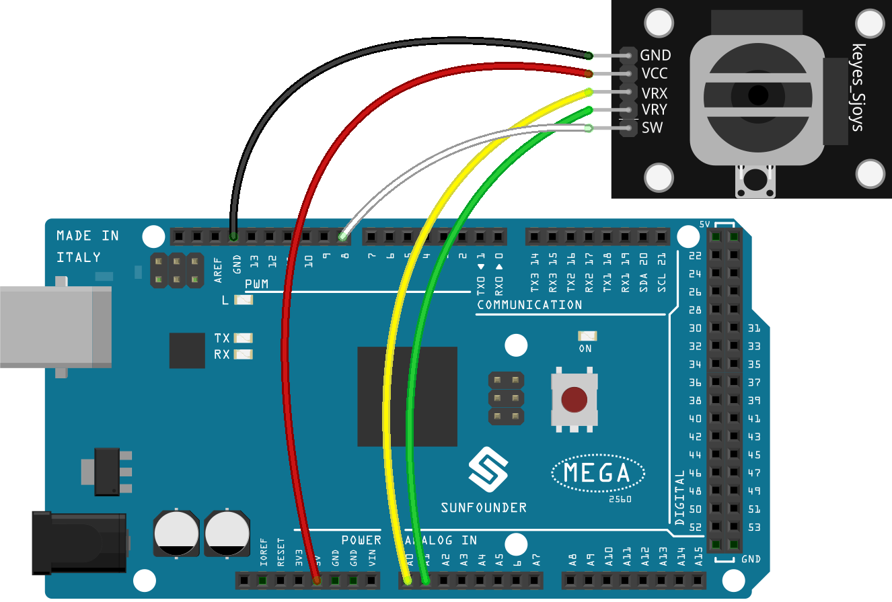

* :ref:`cpn_breadboard`
* :ref:`cpn_joystick`

Προγραμματισμός
------------------

**1. Dragon**

Το σκηνικό **Woods** προστίθεται μέσω του κουμπιού **Choose a Backdrop**.

.. image:: img/19_dragon01.png

* Διαγράψτε την προεπιλεγμένη μορφή και προσθέστε τη μορφή **Dragon**.

.. image:: img/19_dragon0.png

* Μεταβείτε στη σελίδα **Costumes** και γυρίστε τα dragon-b και dragon-c οριζόντια.

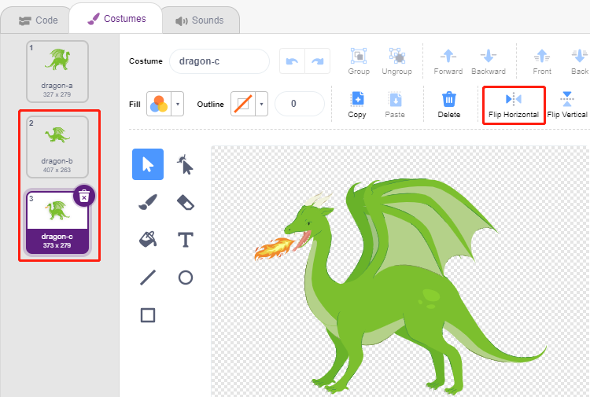

* Ρυθμίστε το μέγεθος στο 50%.

.. image:: img/19_dragon3.png

* Τώρα δημιουργήστε μια μεταβλητή - **dragon** για να καταγράψετε τα επίπεδα "ζωής" του δράκου και ορίστε την αρχική τιμή σε 50.

.. image:: img/19_dragon2.png

* Στη συνέχεια, αλλάξτε την ενδυμασία της μορφής σε **dragon-b** και βάλτε τη μορφή **Dragon** να κινείται πάνω-κάτω σε ένα εύρος.

.. image:: img/19_dragon4.png

* Προσθέστε τη μορφή **Lightning** για τη φλόγα που θα εκτοξεύει η μορφή Dragon. Πρέπει να τhn περιστρέψετε κατά 90° δεξιόστροφα στη σελίδα Costumes, για να κάνετε τη μορφή Lightning να κινηθεί προς τη σωστή κατεύθυνση.

.. note::
    Καθώς προσαρμόζετε την ενδυμασία της μορφής Lightning, μπορεί να τη μετακινήσετε εκτός κέντρου, κάτι που πρέπει να αποφευχθεί! Το κεντρικό της σημείο πρέπει να βρίσκεται ακριβώς στη μέση της μορφής!

.. image:: img/19_lightning1.png

* Στη συνέχεια, προσαρμόστε την ενδυμασία **dragon-c** της μορφής **Dragon** έτσι ώστε το κεντρικό σημείο της να βρίσκεται στην ουρά της φλόγας. Αυτό θα φέρει τις μορφές **Dragon** και **Lightning** στη σωστή θέση και θα αποτρέψει την εκτόξευση της φλόγας **Lightning** από τα πόδια του δράκου.

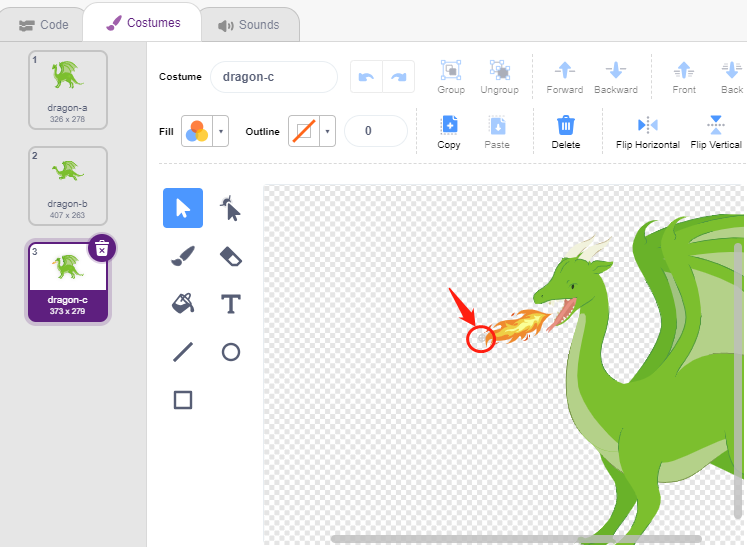

* Αντίστοιχα, το **dragon-b** πρέπει να κάνει το κεφάλι του δράκου να συμπίπτει με το κεντρικό σημείο.

* Προσαρμόστε το μέγεθος και τον προσανατολισμό της μορφής **Lightning** για να κάνετε την εικόνα να φαίνεται πιο αρμονική.

.. image:: img/19_lightning3.png

* Τώρα γράψτε το σενάριο για τη μορφή **Lightning**. Αυτό είναι εύκολο, απλά αφήστε τη να ακολουθεί τη μορφή **Dragon** όλη την ώρα. Σε αυτό το σημείο, κάντε κλικ στην πράσινη σημαία και θα δείτε τον **Dragon** να κινείται με τη μορφή **Lightning** στο στόμα του.

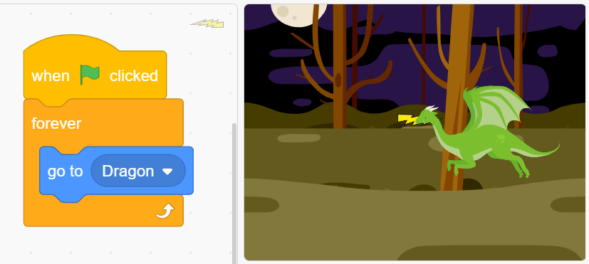

* Επιστρέψτε στη μορφή **Dragon**, κάντε τη τώρα να σβήνει τη φλόγα, προσέχοντας να μην αφήσετε την ίδια τη φλόγα στο στόμα της μορφής **Dragon** να εκτοξευτεί, αλλά  έναν κλώνο της μορφής **Lightning** που θα δημιουργήσετε γι' αυτό το λόγο.

.. image:: img/19_dragon6.png

* Κάντε κλικ στη μορφή **Lightning** και αφήστε τον κλώνο **Lightning** να εκτοξευτεί σε τυχαία γωνία, να αναπηδήσει από τον τοίχο και να εξαφανιστεί μετά από ένα ορισμένο χρονικό διάστημα.

.. image:: img/19_lightning5.png

* Στη μορφή **Lightning**, κρύψτε το σώμα της και δείξτε τον κλώνο.

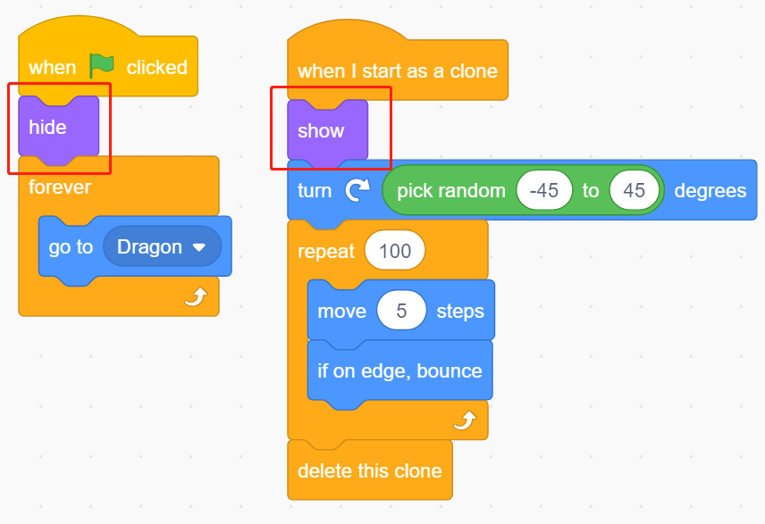

Τώρα ο δράκος μπορεί να κινηθεί πάνω-κάτω και να εκτοξεύει τη φλόγα..

**2. Ραβδί**

* Δημιουργήστε μια μορφή **Wand** και περιστρέψτε την κατεύθυνσή της κατά 180 μοίρες για να δείχνει προς τα δεξιά.

.. image:: img/19_wand1.png

* Τώρα δημιουργήστε μια μεταβλητή **hp** για να καταγράψετε τις ζωές" της, αρχικά ρυθμισμένη στο 3. Στη συνέχεια, διαβάστε την τιμή του Joystick, η οποία χρησιμοποιείται για τον έλεγχο της κίνησης του ραβδιού.

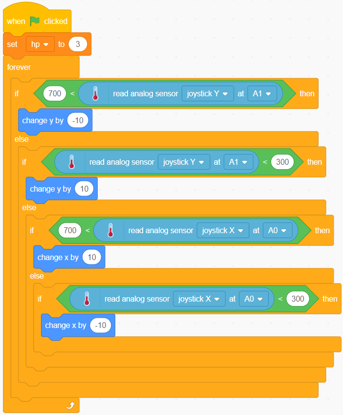

* Ο δράκος έχει τη φλόγα και το ραβδί που τον εξαφανίζει έχει τη «μαγική του σφαίρα»! Δημιουργήστε μια μορφή **Star**, αλλάξτε το μέγεθός της και γράψτε το σενάριο ώστε να ακολουθεί πάντα τη μορφή **Wand**, περιορίζοντας τον αριθμό των αστεριών σε τρία.

.. image:: img/19_star2.png

* Κάντε τη μορφή **Wand** να πυροβολεί αστεράκια αυτόματα. Η μορφή **Wand** πυροβολεί αστεράκια με τον ίδιο τρόπο που ο δράκος βγάζει φλόγες –- δημιουργώντας κλώνους.

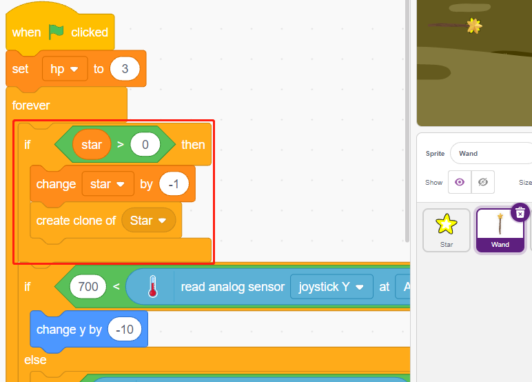

* Επιστρέψτε στη μορφή **Star** και γράψτε το σενάριο ώστε ο κλώνος του να γυρίζει και να πυροβολεί προς τα δεξιά, να εξαφανίζεται αφού περάσει από τη σκηνή, με επαναφορά του αριθμού των αστεριών. Όπως κάνατε με τη μορφή Lightning, κρύψτε το σώμα και εμφανίστε τον κλώνο.

.. image:: img/19_star3.png

Τώρα έχουμε ένα ραβδί που εκτοξεύει αστεράκια.

**3. Μάχη!**

Το ραβδί και ο δράκος προς το παρόν εξακολουθούν να βρίσκονται το ένα απέναντι στον άλλο και θα τους κάνουμε να μαλώσουν. Ο δράκος είναι δυνατός και το ραβδί είναι ο γενναίος που μάχεται εναντίον του δράκου. Η μεταξύ τους αλληλεπίδραση αποτελείται από τα ακόλουθα μέρη.

1. αν το ραβδί αγγίξει τον δράκο, αυτός θα τιναχτεί πίσω και θα χάσει πόντους ζωής.
2. εάν η φλόγα χτυπήσει το ραβδί, το ραβδί θα χάσει πόντους ζωής.
3. αν τα αστέρια χτυπήσουν τον δράκο, ο δράκος θα χάσει πόντους ζωής.

Μετά από αυτή τη διευθέτηση, ας προχωρήσουμε στην αλλαγή των σεναρίων για κάθε μορφή.

* Εάν η μορφή **Wand** χτυπήσει την μορφή **Dragon**, αυτή θα τιναχτεί πίσω και θα χάσει πόντους ζωής.

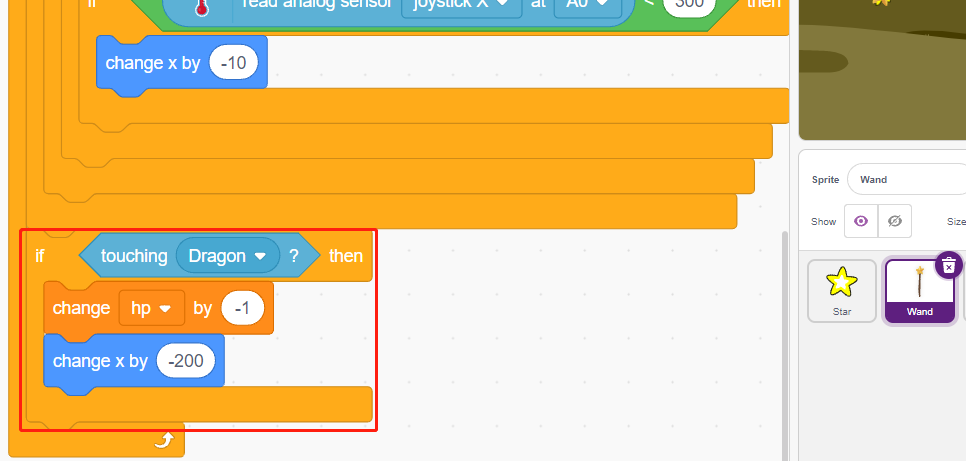

* Εάν η μορφή **Lightning** (ένας κλώνος της μορφής **Lightning**) χτυπήσει τη μορφή **Wand**, αυτή θα κάνει έναν ήχο "pop" και θα εξαφανιστεί, ενώ η μορφή **Wand** θα χάσει πόντους ζωής.

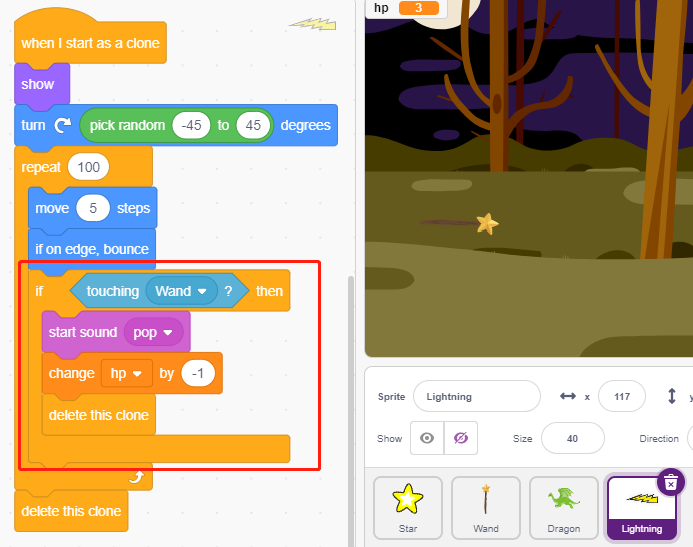

* Εάν η μορφή **Star** (κλώνος της μορφής **Star**) χτυπήσει τη μορφή **Dragon**, θα εκπέμψει έναν ήχο "collect" και θα εξαφανιστεί, ενώ θα επαναφερθεί ο αριθμός των **Star** και η μορφή **Dragon** θα χάσει πόντους ζωής.

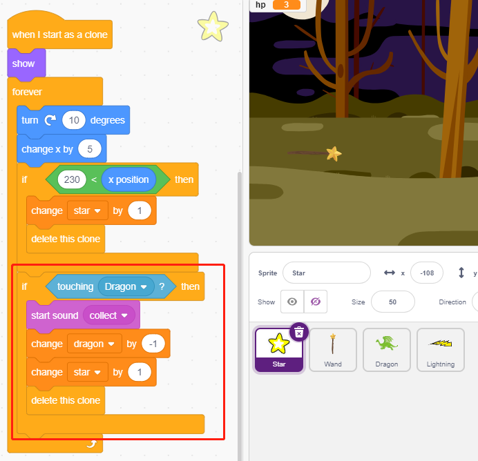

**4. Σκηνή**

Η μάχη ανάμεσα στις μορφές **Wand** και **Dragon** βαθμιαία θα χωριστεί σε νικητές και ηττημένους, κάτι το οποίο θα αναπαριστήσουμε στη Σκηνή.

* Προσθέστε το φόντο **Blue Sky** και γράψτε τον χαρακτήρα «WIN!» πάνω του για να αναπαραστήσουμε το ότι ο δράκος νικήθηκε και ήρθε η αυγή.

.. image:: img/19_sky0.png

* Και τροποποιήστε το κενό φόντο ως εξής, για να δηλώσετε ότι το παιχνίδι απέτυχε και ότι όλα θα είναι στο σκοτάδι.

.. image:: img/19_night.png

* Τώρα γράψτε ένα σενάριο για εναλλαγή αυτών των φόντων, όταν κάνετε κλικ στην πράσινη σημαία, μεταβείτε στο σηκηνικό **Woods**. Εάν ο βαθμός "ζωής" του δράκου είναι μικρότερος από 1, τότε θεωρούμε ότι ο δράκος νικήθηκε και θα αλλάζει το σκηνικό σε **Blue Sky**. Εάν η τιμή της "ζωής" του ραβδιού είναι μικρότερη από 1, τότε θεωρούμε ότι η μάθη χάθηκε και το σκηνικό θα αλλάζει σε **Night**.

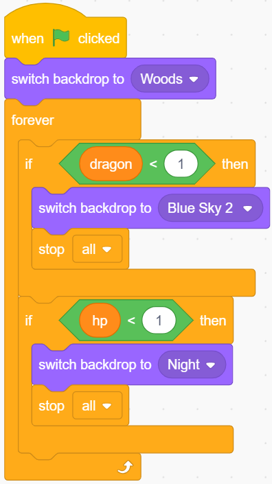
