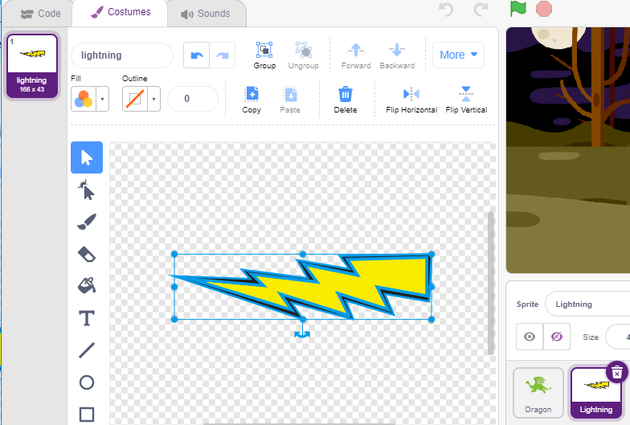

.. _dragon:

2.22 ΠΑΙΧΝΙΔΙ - Kill Dragon
============================

Εδώ, χρησιμοποιούμε το joystick για να παίξουμε ένα παιχνίδι εξάλειψης δράκων.

Όταν κάνετε κλικ στην πράσινη σημαία, ο δράκος θα αιωρείται πάνω-κάτω στη δεξιά πλευρά και θα εκτοξεύει φλόγες κατά διαστήματα. Πρέπει να χρησιμοποιήσετε το joystick για να ελέγξετε την κίνηση του μαγικού ραβδιού και να εξαπολύσετε επιθέσεις με αστέρια εναντίον του δράκου, αποφεύγοντας τις φλόγες που εκτοξεύει και τελικά να τον νικήσετε.

.. image:: img/19_dragon.png

Κατασκευάστε το κύκλωμα
-----------------------

Το joystick είναι μια συσκευή εισόδου που αποτελείται από ένα μοχλό που περιστρέφεται σε μια βάση και αναφέρει τη γωνία ή την κατεύθυνσή του στη συσκευή που ελέγχει. Τα joysticks χρησιμοποιούνται συχνά για τον έλεγχο βιντεοπαιχνιδιών και ρομπότ.

Για να επικοινωνήσει ένα πλήρες εύρος κίνησης στον υπολογιστή, το joystick πρέπει να μετρήσει τη θέση του μοχλού σε δύο άξονες – τον άξονα Χ (από αριστερά προς τα δεξιά) και τον άξονα Υ (από πάνω προς τα κάτω).

Οι συντεταγμένες κίνησης του joystick φαίνονται στο παρακάτω σχήμα.

.. note::

    * Η συντεταγμένη x μετράει την κίνηση από αριστερά προς τα δεξιά, το εύρος τιμών της είναι 0-1023.
    * Η συντεταγμένη y μετράει την κίνηση από πάνω προς τα κάτω, το εύρος τιμών της είναι 0-1023.
    
    
.. image:: img/16_joystick.png

Κατασκευάστε τώρα το κύκλωμα σύμφωνα με το παρακάτω διάγραμμα.

* :ref:`cpn_breadboard`
* :ref:`cpn_joystick`

Προγραμματισμός
------------------

**1. Dragon**

Το σκηνικό **Woods** προστίθεται μέσω του κουμπιού **Choose a Backdrop**.

.. image:: img/19_dragon01.png

* Διαγράψτε την προεπιλεγμένη μορφή και προσθέστε τη μορφή **Dragon**.

.. image:: img/19_dragon0.png

* Μεταβείτε στη σελίδα **Costumes** και γυρίστε τα dragon-b και dragon-c οριζόντια.

.. image:: img/19_dragon1.png

* Ρυθμίστε το μέγεθος στο 50%.

.. image:: img/19_dragon3.png

* Τώρα δημιουργήστε μια μεταβλητή - **dragon** για να καταγράψετε τα επίπεδα "ζωής" του δράκου και ορίστε την αρχική τιμή σε 50.

.. image:: img/19_dragon2.png

* Στη συνέχεια, αλλάξτε την ενδυμασία της μορφής σε **dragon-b** και βάλτε τη μορφή **Dragon** να κινείται πάνω-κάτω σε ένα εύρος.

.. image:: img/19_dragon4.png

* Προσθέστε τη μορφή **Lightning** για τη φλόγα που θα εκτοξεύει η μορφή Dragon. Πρέπει να τhn περιστρέψετε κατά 90° δεξιόστροφα στη σελίδα Costumes, για να κάνετε τη μορφή Lightning να κινηθεί προς τη σωστή κατεύθυνση.

.. note::
    Καθώς προσαρμόζετε την ενδυμασία της μορφής Lightning, μπορεί να τη μετακινήσετε εκτός κέντρου, κάτι που πρέπει να αποφευχθεί! Το κεντρικό της σημείο πρέπει να βρίσκεται ακριβώς στη μέση της μορφής!

* Στη συνέχεια, προσαρμόστε την ενδυμασία **dragon-c** της μορφής **Dragon** έτσι ώστε το κεντρικό σημείο της να βρίσκεται στην ουρά της φλόγας. Αυτό θα φέρει τις μορφές **Dragon** και **Lightning** στη σωστή θέση και θα αποτρέψει την εκτόξευση της φλόγας **Lightning** από τα πόδια του δράκου.

.. image:: img/19_dragon5.png

* Αντίστοιχα, το **dragon-b** πρέπει να κάνει το κεφάλι του δράκου να συμπίπτει με το κεντρικό σημείο.

.. image:: img/19_dragon5.png

* Προσαρμόστε το μέγεθος και τον προσανατολισμό της μορφής **Lightning** για να κάνετε την εικόνα να φαίνεται πιο αρμονική.

.. image:: img/19_lightning3.png

* Τώρα γράψτε το σενάριο για τη μορφή **Lightning**. Αυτό είναι εύκολο, απλά αφήστε τη να ακολουθεί τη μορφή **Dragon** όλη την ώρα. Σε αυτό το σημείο, κάντε κλικ στην πράσινη σημαία και θα δείτε τον **Dragon** να κινείται με τη μορφή **Lightning** στο στόμα του.

.. image:: img/19_lightning4.png

* Επιστρέψτε στη μορφή **Dragon**, κάντε τη τώρα να σβήνει τη φλόγα, προσέχοντας να μην αφήσετε την ίδια τη φλόγα στο στόμα της μορφής **Dragon** να εκτοξευτεί, αλλά  έναν κλώνο της μορφής **Lightning** που θα δημιουργήσετε γι' αυτό το λόγο.

.. image:: img/19_dragon6.png

* Κάντε κλικ στη μορφή **Lightning** και αφήστε τον κλώνο **Lightning** να εκτοξευτεί σε τυχαία γωνία, να αναπηδήσει από τον τοίχο και να εξαφανιστεί μετά από ένα ορισμένο χρονικό διάστημα.

.. image:: img/19_lightning5.png

* Στη μορφή **Lightning**, κρύψτε το σώμα της και δείξτε τον κλώνο.

.. image:: img/19_lightning6.png

Τώρα ο δράκος μπορεί να κινηθεί πάνω-κάτω και να εκτοξεύει τη φλόγα..

**2. Ραβδί**

* Δημιουργήστε μια μορφή **Wand** και περιστρέψτε την κατεύθυνσή της κατά 180 μοίρες για να δείχνει προς τα δεξιά.

.. image:: img/19_wand1.png

* Τώρα δημιουργήστε μια μεταβλητή **hp** για να καταγράψετε τις ζωές" της, αρχικά ρυθμισμένη στο 3. Στη συνέχεια, διαβάστε την τιμή του Joystick, η οποία χρησιμοποιείται για τον έλεγχο της κίνησης του ραβδιού.

* Ο δράκος έχει τη φλόγα και το ραβδί που τον εξαφανίζει έχει τη «μαγική του σφαίρα»! Δημιουργήστε μια μορφή **Star**, αλλάξτε το μέγεθός της και γράψτε το σενάριο ώστε να ακολουθεί πάντα τη μορφή **Wand**, περιορίζοντας τον αριθμό των αστεριών σε τρία.

.. image:: img/19_star2.png

* Κάντε τη μορφή **Wand** να πυροβολεί αστεράκια αυτόματα. Η μορφή **Wand** πυροβολεί αστεράκια με τον ίδιο τρόπο που ο δράκος βγάζει φλόγες –- δημιουργώντας κλώνους.

* Επιστρέψτε στη μορφή **Star** και γράψτε το σενάριο ώστε ο κλώνος του να γυρίζει και να πυροβολεί προς τα δεξιά, να εξαφανίζεται αφού περάσει από τη σκηνή, με επαναφορά του αριθμού των αστεριών. Όπως κάνατε με τη μορφή Lightning, κρύψτε το σώμα και εμφανίστε τον κλώνο.

.. image:: img/19_star3.png

Τώρα έχουμε ένα ραβδί που εκτοξεύει αστεράκια.

**3. Μάχη!**

The wand and the dragon are currently still at odds with each other, and we're going to make them fight. The dragon is strong, and the wand is the brave man who crusades against the dragon. The interaction between them consists of the following parts.

1. if the wand touches the dragon, it will be knocked back and lose life points.
2. if lightning strikes the wand, the wand will lose life points.
3. if the star bullet hits the dragon, the dragon will lose life points.

Once that's sorted out, let's move on to changing the scripts for each sprite.

* If the **Wand** hits the **Dragon**, it will be knocked back and lose life points.

.. image:: img/19_wand4.png

* If **Lightning** (a **Lightning** sprite clone) hits the **Wand** sprite, it will make a pop sound and disappear, and the **Wand** will lose life points.

.. image:: img/19_lightning7.png

* If a **Star** (clone of the **Star** sprite) hits the **Dragon**, it will emit a collect sound and disappear, while restoring the **Star** count, and the **Dragon** will lose life points.

.. image:: img/19_star4.png

**4. stage**

The battle between the **Wand** and the **Dragon** will eventually be divided into winners and losers, which we represent with the stage.

* Add **Blue Sky** backgdrop, and write the character "WIN!" on it to represent that the dragon has been defeated and the dawn has come.

.. image:: img/19_sky0.png

* And modify the blank backdrop as follows, to represent that the game has failed and everything will be in darkness.

.. image:: img/19_night.png

* Now write a script to switch these backgdrops, when the green flag is clicked, switch to **Woods** backgdrop; if the dragon's life point is less than 1 , then the game succeeds and switch the backdrop to **Blue Sky**; if the life value point of the **Wand** is less than 1, then switch to **Night** backdrop and the game fails.

.. image:: img/19_sky1.png
