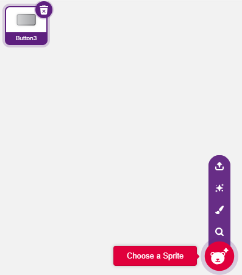
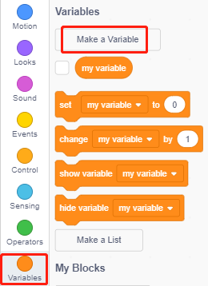
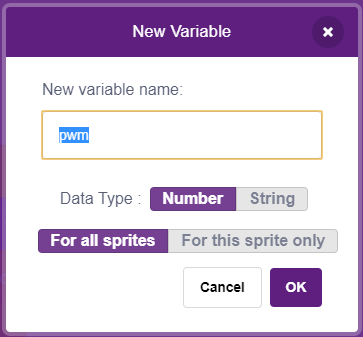
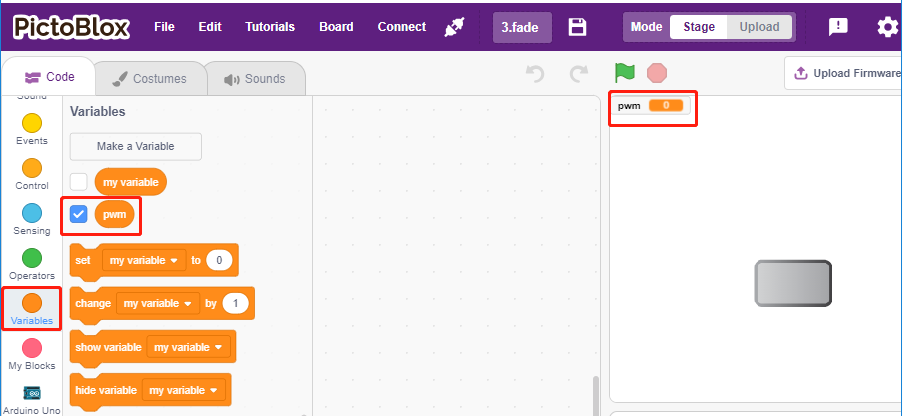
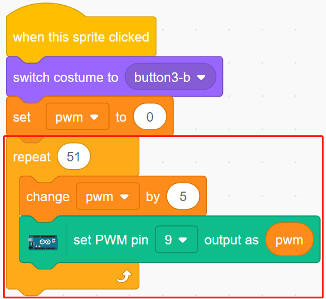
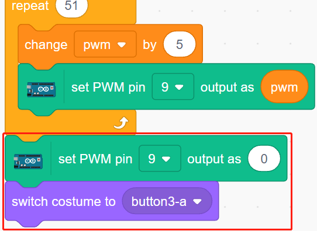

.. _breathing_led:

2.2 LED αναπνοής
========================

Θα χρησιμοποιήσουμε τωρα μια άλλη μέθοδο για να ελέγξουμε τη φωτεινότητα του LED. Σε αντίθεση με το προηγούμενο έργο, εδώ η φωτεινότητα του LED μειώνεται αργά μέχρι να σβήσει.

Όταν κάνετε κλικ στη μορφή της σκηνής, η φωτεινότητα του LED αυξάνεται αργά και στη συνέχεια σβήνει αμέσως.

.. image:: img/3_ap.png

Θα μάθετε
---------------------

- Να ρυθμίζετε την τιμή εξόδου της ακίδας PWM
- Να δημιουργείτε μεταβλητές
- Να αλλάζετε τη φωτεινότητα μορφής

Κατασκευάστε το κύκλωμα
-----------------------

Σε αυτό το έργο το κύκλωμα είναι το ίδιο με αυτό του προηγούμενου έργου :ref:`table_lamp`, αλλά αντί να χρησιμοποιεί HIGH/LOW για να ανάβουν ή να σβήνουν τα LED, το παρόν έργο χρησιμοποιεί το σήμα `PWM - Wikipedia <https://en.wikipedia.org/wiki/Pulse-width_modulation>`_  για να ανάβει ή να σβήνει βαθμιαία το LED.

Το εύρος σήματος του PWM είναι 0-255. Στην πλακέτα Arduino Uno, οι ακίδες εξόδου 3, 5, 6, 9, 10, 11 μπορούν να εξάγουν σήμα PWM. Στο Mega2560, οι ακίδες 2 - 13, 44 - 46 μπορούν να εξάγουν σήμα PWM.

.. image:: img/circuit/led_circuit.png

* :ref:`cpn_breadboard`
* :ref:`cpn_led`
* :ref:`cpn_resistor`

Προγραμματισμός
------------------

**1. Επιλέξτε μια μορφη**

Delete the default sprite, click the **Choose a Sprite** button in the lower right corner of the sprite area, enter **button3** in the search box, and then click to add it.

**2. Δημιουργήστε μια μεταβλητή**.

Create a variable called **pwm** to store the value of the pwm change.

Click on the **Variables** palette and select **Make a Variable**.

Enter the name of the variable, it can be any name, but it is recommended to describe its function. The data type is number and For all sprites.

Once created, you will see **pwm** inside the **Variables** palette and in the checked state, which means this variable will appear on the stage. You can try unchecking it to see if pwm is still present on the stage.

**3. Set the initial state**

When the **button3** sprite is clicked, switch the costume to **button-b** (clicked state), and set the initial value of the variable **pwm** to 0.

* [set pwm to 0]: from **Variables** palette, used to set the value of the variable.

.. image:: img/3_ap_brightness.png

**4. Make the LED brighter and brighter**

Since the range of pwm is 255, so by [repeat] block, the variable **pwm** is accumulated to 255 by 5, and then put into [set PWM pin] block, so you can see the LED slowly light up.

* [change pwm by 5]: from **Variables** palette, let the variable change a specific number each time. It can be a positive or negative number, positive is increasing each time, negative is decreasing each time, for example, here the variable pwm is increased by 5 each time.
* [set PWM pin]: from the **Arduino Uno** palette, used to set the output value of the pwm pin.

Finally, switch the costume of button3 back to **button-a** and make the PWM pin value 0, so that the LED will light up slowly and then turn off again.

