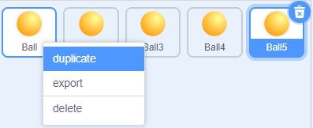
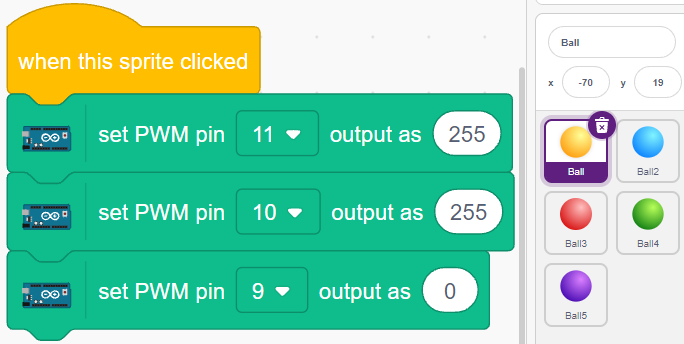
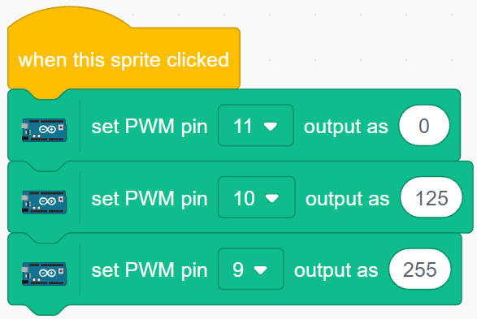
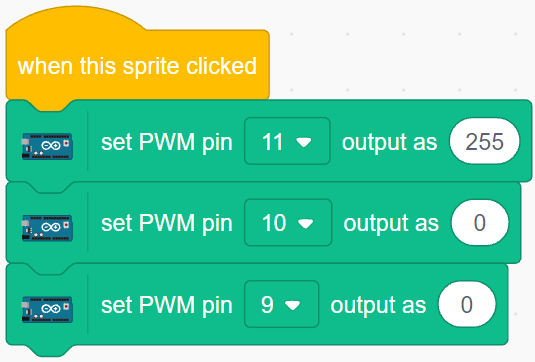
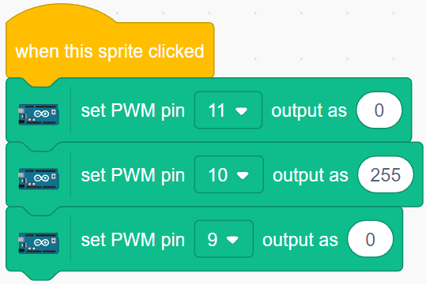
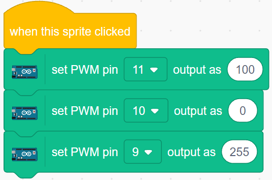

.. _colorful_ball:

2.3 Πολύχρωμες Μπάλες
=====================

Σε αυτό το έργο, θα κάνουμε τα RGB LED να εμφανίζουν διαφορετικά χρώματα.

Κάνοντας κλικ σε διαφορετικές χρωματιστές μπάλες στην περιοχή της σκηνής, το RGB LED θα ανάψει σε διαφορετικά χρώματα.

.. image:: img/4_color.png

Θα μάθετε
---------------------

- Την αρχή λειτουργίας του LED RGB
- Να αντιγράφετε μορφές και να επιλέγετε διαφορετικές ενδυμασίες
- Πώς να συνδυάζετε (υπερθέτετε) τα τρία βασικά χρώματα

Κατασκευάστε το κύκλωμα
---------------------

Ένα RGB LED εμπεριέχει τρία LED, κόκκινου, πράσινου και μπλε σε ένα διαφανές ή ημιδιαφανές πλαστικό κέλυφος. Μπορεί να εμφανίζει διάφορα χρώματα αλλάζοντας την τάση εισόδου των τριών ακίδων του και να τα υπερθέτει, με τρόπο που, σύμφωνα με τη στατιστική, μπορεί να δημιουργήσει 16.777.216 διαφορετικά χρώματα.

.. image:: img/4_rgb.png
    :width: 300

.. image:: img/circuit/rgb_circuit.png

* :ref:`cpn_breadboard`
* :ref:`cpn_rgb`
* :ref:`cpn_resistor`

Programming
------------------

**1. Select sprite**

Delete the default sprite, then choose the **Ball** sprite.

.. image:: img/4_ball.png

And duplicate it 5 times.

Choose different costumes for these 5 **Ball** sprites and move them to the corresponding positions.

.. note::

    **Ball3** sprite costume color needs to be manually changed to red.

.. image:: img/4_rgb1.png
    :width: 800

**2. Make RGB LEDs light up in the appropriate color**

Before understanding the code, we need to understand the `RGB color model <https://en.wikipedia.org/wiki/RGB_color_model>`_.

The RGB color model is an additive color model in which red, green, and blue light are added together in various ways to reproduce a broad array of colors. 

Additive color mixing: adding red to green yields yellow; adding green to blue yields cyan; adding blue to red yields magenta; adding all three primary colors together yields white.

.. image:: img/4_rgb_addition.png
  :width: 400

So the code to make the RGB LED light yellow is as follows.

When the Ball sprite (yellow ball) is clicked, we set pin 11 high (red LED on), pin 10 high (green LED on) and pin 9 low (blue LED off) so that the RGB LED will light yellow.

You can write codes to other sprites in the same way to make the RGB LEDs light up in the corresponding colors.

**3. Ball2 sprite (light blue)**

**4. Ball3 sprite (red)**

**5. Ball4 sprite (green)**

**6. Ball5 sprite (purple)**

