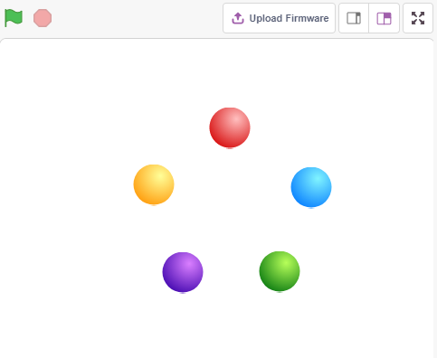

.. _colorful_ball:

2.3 Πολύχρωμες Μπάλες
=====================

Σε αυτό το έργο, θα κάνουμε τα RGB LED να εμφανίζουν διαφορετικά χρώματα.

Κάνοντας κλικ σε διαφορετικές χρωματιστές μπάλες στην περιοχή της σκηνής, το RGB LED θα ανάψει σε διαφορετικά χρώματα.

Θα μάθετε
---------------------

- Την αρχή λειτουργίας του LED RGB
- Να αντιγράφετε μορφές και να επιλέγετε διαφορετικές ενδυμασίες
- Πώς να συνδυάζετε (υπερθέτετε) τα τρία βασικά χρώματα

Κατασκευάστε το κύκλωμα
---------------------

Ένα RGB LED εμπεριέχει τρία LED, ένα κόκκινο, ένα πράσινου και ένα μπλε σε ένα διαφανές ή ημιδιαφανές πλαστικό κέλυφος. Μπορεί να εμφανίζει διάφορα χρώματα αλλάζοντας την τάση εισόδου των τριών ακίδων του και να υπερθέτει τα τρία βασικά χρώματα, με τρόπο που, σύμφωνα με τη στατιστική, μπορεί να δημιουργήσει 16.777.216 διαφορετικά χρώματα.

.. image:: img/4_rgb.png
    :width: 300

.. image:: img/circuit/rgb_circuit.png

* :ref:`cpn_breadboard`
* :ref:`cpn_rgb`
* :ref:`cpn_resistor`

Προγραμματισμός
------------------

**1. Επιλέξτε μορφή**

Διαγράψτε την προεπιλεγμένη μορφή και, στη συνέχεια, επιλέξτε τη μορφή **Ball**.

.. image:: img/4_ball.png

Και αντιγράψτε (duplicate) τη 5 φορές.

.. image:: img/4_duplicate_ball.png

Επιλέξτε διαφορετικές ενδυμασίες για αυτά τις 5 μορφές **Ball** και μετακινήστε τις στις αντίστοιχες θέσεις.

.. note::

    Το χρώμα της ενδυμασίας της μορφής **Ball3** πρέπει να αλλάξει χειροκίνητα σε κόκκινο.
.. image:: img/4_rgb1.png
    :width: 800

**2. Κάντε το RGB LED να φωτίζει στο κατάλληλο χρώμα**

Πριν κατανοήσουμε τον κώδικα, πρέπει να κατανοήσουμε το `χρωματικό μοντέλο RGB <https://el.wikipedia.org/wiki/RGB>`_.

Το χρωματικό μοντέλο RGB είναι ένα προσθετικό χρωματικό μοντέλο στο οποίο το κόκκινο, το πράσινο και το μπλε φως προστίθενται μαζί με διάφορους τρόπους, για να αναπαράγουν μια ευρεία γκάμα χρωμάτων. 

Προσθετική ανάμειξη χρωμάτων: η προσθήκη κόκκινου σε πράσινο αποδίδει το κίτρινο. Η προσθήκη πράσινου σε μπλε αποδίδει το κυανό χρώμα. Η προσθήκη του μπλε στο κόκκινο αποδίδει το χρώμα ματζέντα, ενώ προσθέτοντας και τα τρία βασικά χρώματα μαζί προκύπτει το λευκό.

.. image:: img/4_rgb_addition.png
  :width: 400

Έτσι, ο κωδικός για να κάνετε το RGB LED ανοιχτό κίτρινο είναι ο εξής:

Όταν θα γίνεται κλικ στη μορφή Ball (κίτρινη μπάλα), ρυθμίζουμε την ακίδα 11 σε υψηλό (κόκκινη λυχνία LED αναμμένη), την ακίδα 10 σε υψηλό (πράσινη λυχνία LED αναμμένη) και την ακίδα 9 σε χαμηλό (μπλε LED σβηστή) έτσι ώστε το RGB LED να φωτίζει με κίτρινο χρώμα.

Μπορείτε να γράψετε κώδικα για τις άλλες μορφές με τον ίδιο τρόπο, ώστε το RGB LED να φωτίζει στα αντίστοιχα χρώματα.

**3. Μορφή Ball2 (ανοιχτό μπλε)**

.. image:: img/4_blue.png

**4. Μορφή Ball3 (κόκκινο)**

.. image:: img/4_red.png

**5. Μορφή Ball4 (πράσινο)**

.. image:: img/4_green.png

**6. Μορφή Ball5 (μωβ)**

