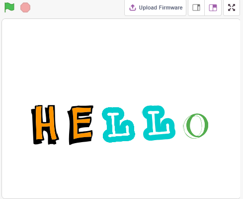
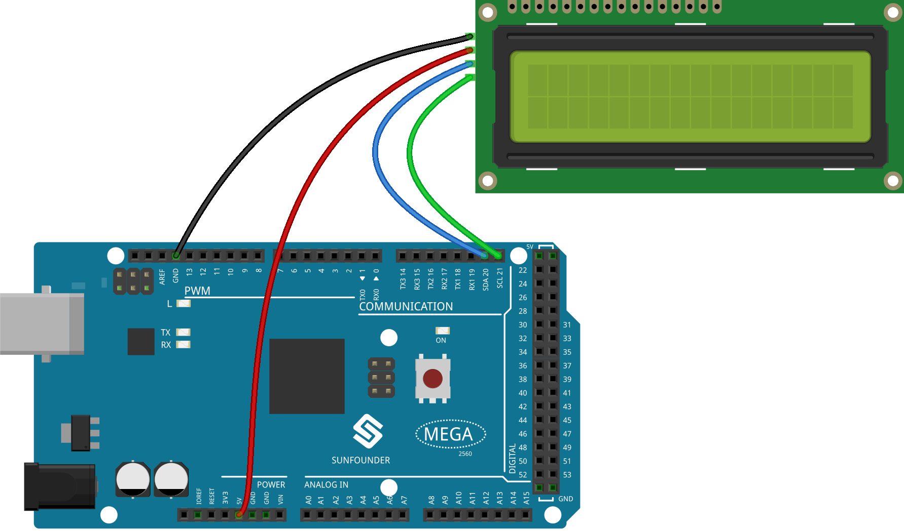
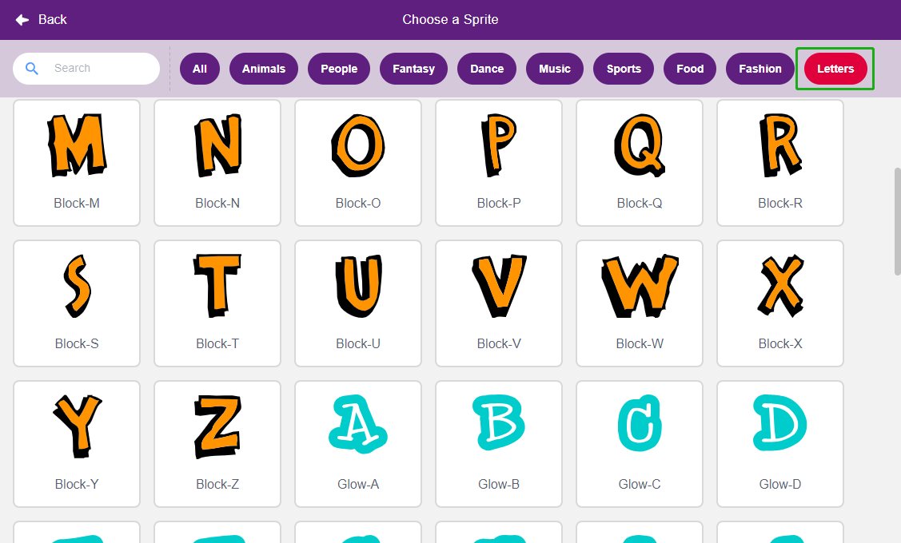
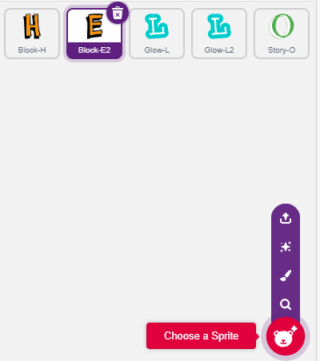
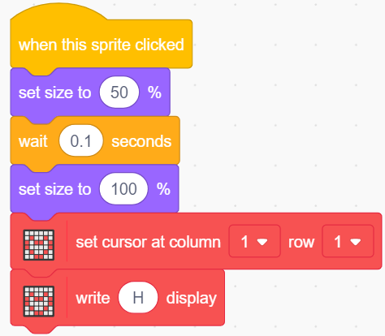
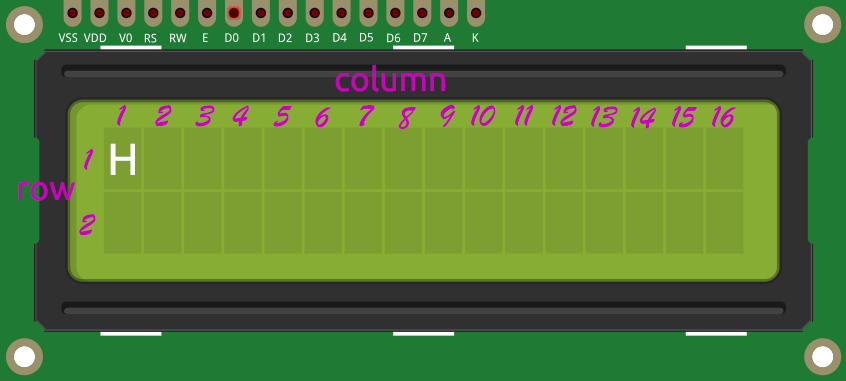
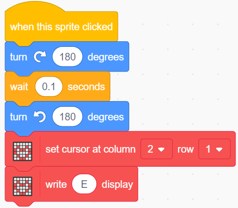
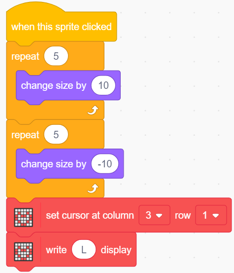
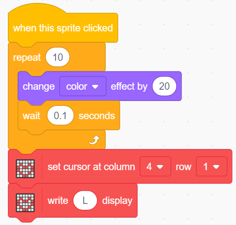
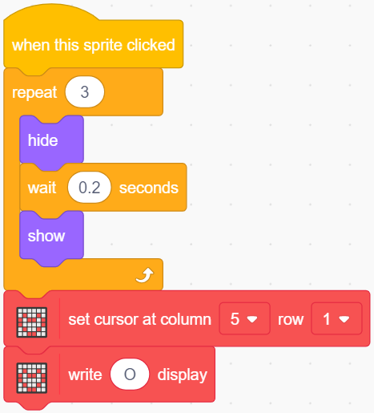

.. _lcd1602:

2.4 LCD1602
=================

H LCD1602 μπορεί να χρησιμοποιηθεί για την εμφάνιση 2x16 χαρακτήρων. Σε ό,τι ακολουθεί θα την προγραμματίσουμε να εμφανίζει τους αντίστοιχους χαρακτήρες με τις μορφές χαρακτήρων στο σκηνικό.

Όταν κάνετε κλικ στους χαρακτήρες του "Hello" έναν προς έναν, θα έχουν διαφορετικά εφέ κινουμένων σχεδίων ο καθένας και θα εμφανίζονται στην οθόνη LCD1602 ταυτόχρονα.

Θα μάθετε
---------------------

- Να χρησιμοποιείτε την οθόνη LCD1602
- Να επιλέγετε πολλές διαφορετικές μορφές
- Να αλλάζετε το μεγέθους μορφής, γωνία περιστροφής, χρώμα και εμφάνιση ή απόκρυψη.

Κατασκευάστε το κύκλωμα
---------------------

* :ref:`cpn_mega2560`
* :ref:`cpn_i2c_lcd1602`

Προγραμματισμός
------------------

**1. Επιλέξτε μορφή**

Διαγράψτε την προεπιλεγμένη μορφή, κάντε κλικ στο **Choose a Sprite**, μετά κάντε κλικ στα **letters** και επιλέξτε τη μορφή που θέλετε.

Για παράδειγμα, επέλεξα το "Hello", όπως φαίνεται παρακάτω.

Τώρα θα δούμε πώς θα ορίσετε διαφορετικά εφέ για αυτές τις μορφές και πώς θα τις εμφανίσετε στην οθόνη LCD1602 ενώ κάνετε κλικ.

**2. Το "H" θα μεγεθύνεται και θα μικραίνει**

Κάντε κλικ στη μορφή **H** για να γράψετε ένα σενάριο για αυτή: όταν κάποιος κάνει κλικ στη μορφή **H**, μίκρυνε το μέγεθός της στο 50% και στη συνέχεια επαναφέρετέ το και εμφάνισε το "H" στην πρώτη γραμμή και στήλη της οθόνης LCD1602.

* [set size to]: Από την παλέτα **Looks**, χρησιμοποιείται για τον ορισμό του μεγέθους της μορφής, από 0% έως 100%.
* [set cursor at columan row]: Από την παλέτα **Display Modules**, χρησιμοποιείται για να ρυθμίσετε τον κέρσορα σε μια συγκεκριμένη γραμμή και στήλη της οθόνης LCD1602, για να ξεκινήσει η εμφάνιση χαρακτήρων.
* [write display]: Από την παλέτα **Display Modules**, χρησιμοποιείται για την εμφάνιση χαρακτήρων ή συμβολοσειρών στην οθόνη LCD1602.

Η κατανομή των γραμμών και των στηλών στην οθόνη LCD1602 φαίνεται στο παρακάτω σχήμα.

**3. Το E γυρίζει αριστερά και δεξιά**

Κάντε κλικ στη μορφή **E** για να γράψετε ένα σενάριο για αυτή: όταν κάποιος κάνει κλικ στη μορφή **E**, αυτή να στρίβει 180 μοίρες δεξιόστροφα και μετά 180 μοίρες αριστερόστροφα, ώστε να γυρίσει αριστερά και δεξιά. Και εμφάνισε το "E" στην πρώτη γραμμή και τη δεύτερη στήλη της οθόνης LCD1602.

* [turn degrees]: Από την παλέτα **Motions**, χρησιμοποιείται για τη στροφή της μορφής δεξιόστροφα ή αριστερόστροφα, το εύρος είναι 0-360 μοίρες.

**4. Το L μεγεθύνεται και μετά συρρικνώνεται βαθμιαία**

Κάντε κλικ στη μορφή του **πρώτου L** για να γράψετε ένα σενάριο για αυτή: όταν κάποιος κάνει κλικ στη μορφή του **L**, αύξήσε το μέγεθός του κατά 50% (5 φορές, 10% κάθε φορά) χρησιμοποιώντας το μπλοκ [repeat], στη συνέχεια συρρίκνωσέ το ξανά στο αρχικό του μέγεθος με τον ίδιο τρόπο και εμφάνισε το L στην πρώτη σειρά και στήλη 3 της οθόνης LCD1602.

* [change size by]: Από την παλέτα **Motions**, χρησιμοποιείται για την αλλαγή του μεγέθους της μορφής.

**5. Το δεύτερο L αλλάζει χρώμα**

Κάντε κλικ στη μορφή του **δεύτερου L** για να γράψετε ένα σενάριο για αυτή: όταν κάποιος κάνει κλικ στη μορφή του **L**, χρησιμοποιώντας το μπλοκ [repeat] επανέλαβε 10 φορές με ρυθμό αύξησης 20 την αλλαγή χρώματος της μορφής και επιστροφή στο αρχικό χρώμα. Εμφάνισε επίσης το L στην πρώτη γραμμή και τη στήλη 4 της οθόνης LCD1602.

* [`change color effect by <https://en.scratch-wiki.info/wiki/Graphic_Effect#Changing_of_colors_using_the_Color_Effect_block>`_]: Χρησιμοποιείται για την αλλαγή του εφέ χρώματος, μια ενδυμασία μπορεί να πάρει 200 διαφορετικούς συνδυασμούς χρωμάτων χρησιμοποιώντας το εφέ χρώματος, τα 0 και 200 είναι το ίδιο χρώμα.

**6. Το O αποκρύπτεται και εμφανίζεται**

Κάντε κλικ στη μορφή του **O** για να γράψετε ένα σενάριο για αυτή: όταν κάποιος κάνει κλικ στη μορφή του **O**, επανέλαβε τη διαδικασία απόκρυψης και εμφάνισης 3 φορές και εμφάνισε το O στην πρώτη σειρά και στη στήλη 5 της LCD1602..

* [Hide] & [Show]: κάνουν τη μορφή να αποκρύπτεται και να εμφανίζεται.

