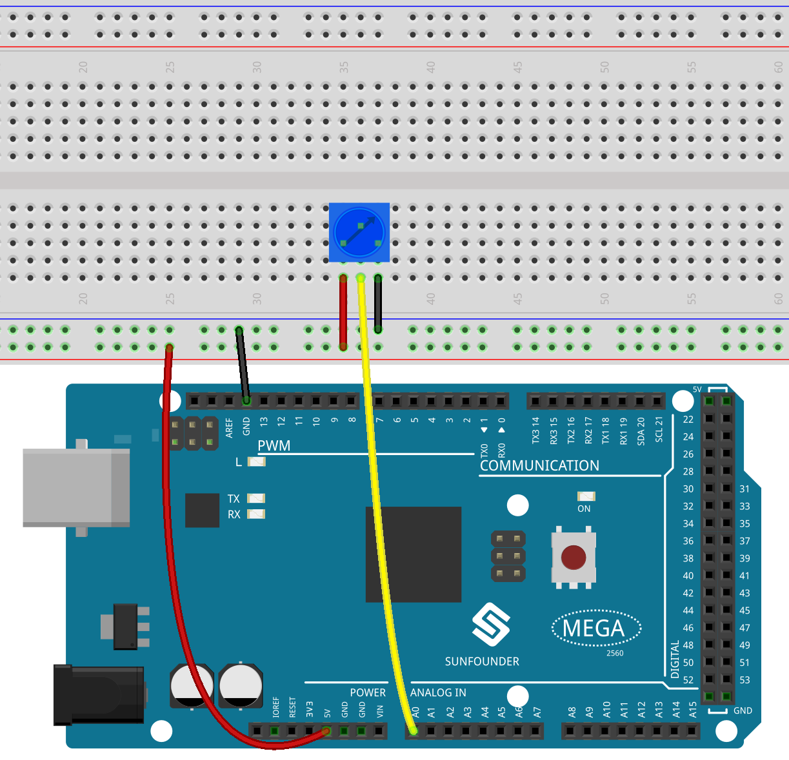
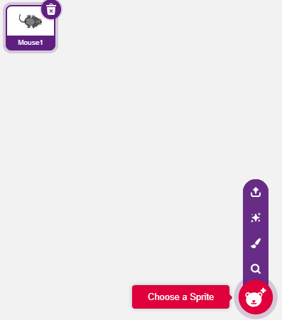
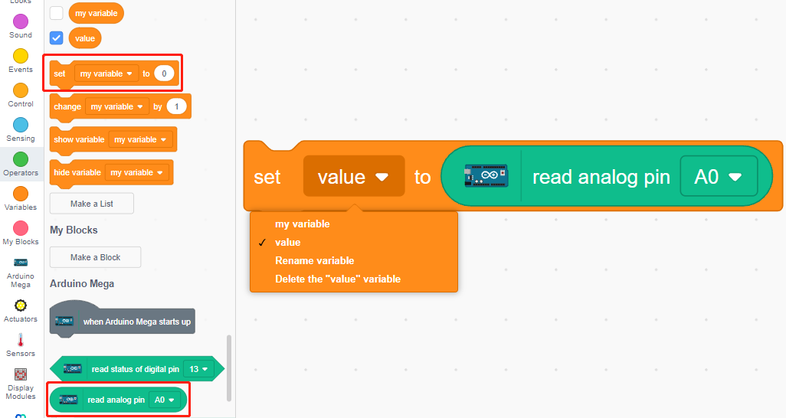
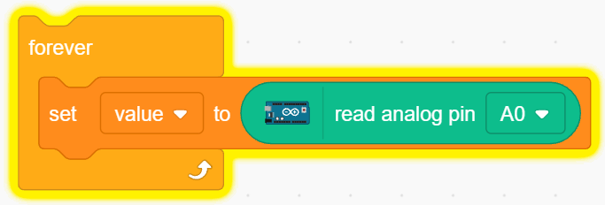
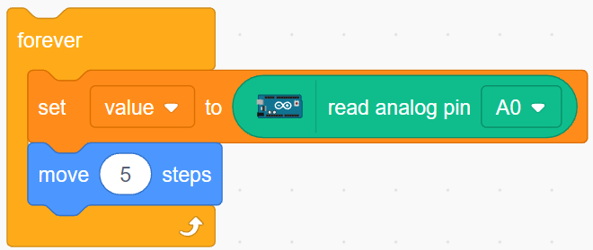
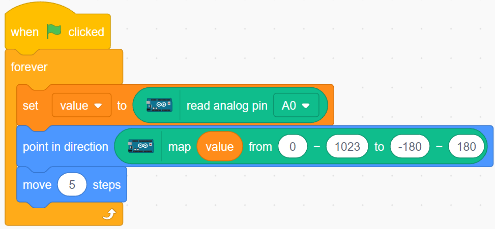

.. _moving_mouse:

2.5 Κινούμενο ποντίκι
===================

Σήμερα θα φτιάξουμε ένα παιχνίδι με ένα ποντίκι που ελέγχεται από ένα ποτενσιόμετρο.

Όταν κάνετε κλικ στην πράσινη σημαία, το ποντίκι στη σκηνή θα κινείται προς τα εμπρός και όταν περιστρέψετε το ποτενσιόμετρο, το ποντίκι θα αλλάζει κατεύθυνση κίνησης.

.. image:: img/6_mouse.png

Θα μάθετε
---------------------

- Την αρχή λειτουργίας του ποτενσιόμετρου
- Να διαβάζετε τον αναλογικό ακροδέκτη (pin) και τα εύρη τιμών του
- Την αντιστοίχιση ενός εύρους σε ένα άλλο
- Τη μετακίνηση και αλλαγή της κατεύθυνσης μορφής

Κατασκευάστε το κύκλωμα
-----------------------

Το ποτενσιόμετρο είναι ένα στοιχείο αντίστασης με 3 ακροδέκτες, οι 2 πλαϊνοί ακροδέκτες συνδέονται στα 5V και GND και ο μεσαίος ακροδέκτης συνδέεται στο A0. Μετά τη μετατροπή από τον μετατροπέα ADC της πλακέτας Arduino, το εύρος τιμών του ποτενσιόμετρου είναι 0-1023.

* :ref:`cpn_breadboard`
* :ref:`cpn_potentiometer`

Προγραμματισμός
------------------

**1. Επιλέξτε μια μορφή**

Διαγράψτε την προεπιλεγμένη μορφή, κάντε κλικ στο κουμπί **Choose a Sprite** στην κάτω δεξιά γωνία της περιοχής των μορφών, πληκτρολογήστε τη λέξη **mouse** στο πλαίσιο αναζήτησης και, στη συνέχεια, κάντε κλικ πάνω του για να το προσθέσετε.

**2. Δημιουργία μεταβλητής**.

Δημιουργήστε μια μεταβλητή με όνομα **value** για να αποθηκεύσετε την τιμή που θα διαβάσετε από το ποτενσιόμετρο.

Μόλις δημιουργηθεί, θα δείτε τη μεταβλητή **value** να εμφανίζεται μέσα στην παλέτα **Variables** και σε κατάσταση "επιλεγμένο", που σημαίνει ότι αυτή η μεταβλητή θα εμφανιστεί στη σκηνή.

.. image:: img/6_value.png

**3. Διαβάστε την τιμή του A0**

Store the value of A0 read into the variable **value**.

* [set my variable to 0]: Set the value of the variable.
* [read analog pin A0]: Read the value of A0~A5 in the range of 0-1023.

To be able to read all the way through, you need to use the [forever] block. Click on this script to run it, rotate the potentiometer in both directions, and you will see that the value range is 0-1023.

**4. Μετακινήστε τη μορφή**

Use the [move steps] block to move the sprite, run the script and you will see the sprite move from the middle to the right.

**5. Changing the sprite's direction**

Now change the direction of the sprite's movement by the value of A0. Since the value of A0 ranges from 0-1023, but the sprite's rotation direction is -180~180, a [map] block needs to be used.

Also add [when green flag clicked] at the beginning to start the script.

* [`point in direction <https://en.scratch-wiki.info/wiki/Point_in_Direction_()_(block)>`_]: Set the steering angle of the sprite, from **Motion** palette.
* [map from to]: Map a range to another range.

