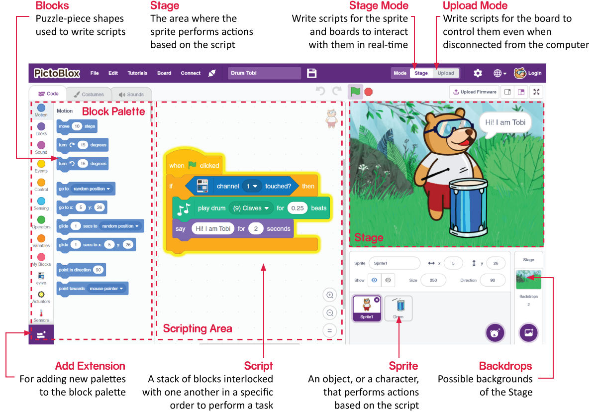

1.2 Εισαγωγή στο Γραφικό Περιβάλλον
================================

**Μορφές**

Μια μορφή είναι ένα αντικείμενο ή χαρακτήρας, που πραγματοποιεί διάφορες ενέργειες σε ένα έργο. Κατανοεί και υπακούει στις εντολές που του δίνονται. Κάθε μορφή έχει συγκεκριμένες ενδυμασίες και ήχους που μπορείτε επίσης να προσαρμόσετε.

**Σκηνή**

Η σκηνή είναι η περιοχή όπου η μορφή εκτελεί ενέργειες, σε κάποιο σκηνικό, σύμφωνα με το πρόγραμμά σας. 

**Σκηνικά**

Τα σκηνικά χρησιμοποιούνται για τη διακόσμηση της σκηνής. Μπορείτε να επιλέξετε ένα σκηνικό από το PictoBlox, να σχεδιάσετε ένα μόνοι σας ή να ανεβάσετε μια εικόνα από τον υπολογιστή σας.

**Περιοχή Σεναρίων**

Ένα σενάριο είναι ένα πρόγραμμα ή κώδικας σε γλώσσα PictoBlox/Scratch. Είναι ένα σύνολο «μπλοκ» που είναι διατεταγμένα με συγκεκριμένη σειρά για την εκτέλεση μιας εργασίας ή μιας σειράς εργασιών. Μπορείτε να γράψετε πολλά σενάρια, τα οποία μπορούν να εκτελούνται όλα ταυτόχρονα. Μπορείτε να γράψετε σενάρια μόνο στην περιοχή σεναρίων στο κέντρο της οθόνης.

**Μπλοκ**

Τα μπλοκ (που αντιστοιχούν στις προγραμματιστικές δομές ελέγχου ροής και τις εντολές των προγραμμάτων) είναι σαν κομμάτια ενός παζλ που χρησιμοποιούνται για τη σύνταξη προγραμμάτων απλά στοιβάζοντάς τα μαζί στην περιοχή του σεναρίου. Η χρήση μπλοκ για τη σύνταξη κώδικα μπορεί να διευκολύνει τον προγραμματισμό και να μειώσει την πιθανότητα σφαλμάτων.

**Παλέτα Μπλοκ (Εντολών)**

Οι παλέτες μπλοκ βρίσκονται στην αριστερή περιοχή του γραφικού περιβάλλοντος και παίρνουν το όνομά τους από τις λειτουργίες τους, όπως "Κίνηση", "Ήχος" και "Έλεγχος". Κάθε παλέτα έχει διαφορετικά μπλοκ, για παράδειγμα, τα μπλοκ στην παλέτα "Κίνηση" ελέγχουν την κίνηση των μορφών και τα μπλοκ στην παλέτα "Έλεγχος" ελέγχουν τις εργασίες του σεναρίου με βάση συγκεκριμένες συνθήκες.

Υπάρχουν και άλλου τύπου παλέτες μπλοκ που μπορούν να φορτωθούν από το κουμπί **Add Extension** που βρίσκεται κάτω αριστερά.

**Λειτουργίες**

Σε αντίθεση με το Scratch, το PictoBlox έχει δύο λειτουργίες (modes):

* :ref:`Stage Mode`: Σε αυτήν τη λειτουργία, μπορείτε να γράψετε σενάρια για τις μορφές και την αλληλεπίδραση της πλακέτας ελέγχου με τις μορφές σε πραγματικό χρόνο. Εάν αποσυνδέσετε την πλακέτα από το Pictoblox, δεν μπορείτε πλέον να αλληλεπιδράσετε.
* :ref:`Upload Mode`: Αυτή η λειτουργία σάς επιτρέπει να γράψετε σενάρια και να τα ανεβάσετε στην πλακέτα ελέγχου, ώστε να μπορείτε να τη χρησιμοποιήσετε ακόμα και όταν δεν είναι συνδεδεμένη στον υπολογιστή σας, για παράδειγμα, να ανεβάσετε ένα σενάριο για την κατασκευή κινούμενων ρομπότ.

Για περισσότερες πληροφορίες, δείτε παρακαλώ το: https://thestempedia.com/tutorials/getting-started-pictoblox
