1.3 Γρήγορος Οδηγός για το PictoBlox
====================================

Ας μάθουμε τώρα πώς χρησιμοποιούμε το PictoBlox με τους 2 τρόπους λειτουργίας.

Επίσης, υπάρχει μια ενσωματωμένη λυχνία LED συνδεδεμένη με τον ακροδέκτη 13 στο Arduino Uno/Mega2560. Θα μάθουμε να κάνουμε αυτό το LED να αναβοσβήνει σε καθέναν από τους 2 τρόπους λειτουργίας.

.. image:: img/1_led.jpg
    :width: 500
    :align: center

Λειτουργία Stage
---------------

**1. Σύνδεση στην πλακέτα Arduino**

Συνδέστε την πλακέτα Arduino στον υπολογιστή με ένα καλώδιο USB. Συνήθως ο υπολογιστής αναγνωρίζει αυτόματα την πλακέτα σας και τελικά θα της εκχωρήσει μια θύρα COM.

Ανοίξτε το PictoBlox. Η διεπαφή προγραμματισμού Python θα ανοίξει από προεπιλογή και πρέπει να μεταβούμε στη διεπαφή Blocks.

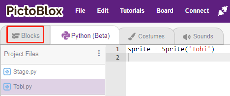

Στη συνέχεια θα δείτε την επάνω δεξιά γωνία για εναλλαγή λειτουργίας. Η προεπιλογή είναι η λειτουργία Stage, όπου ο Tobi στέκεται στη σκηνή.

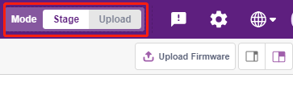

Κάντε κλικ στο **Board** στην επάνω δεξιά γραμμή πλοήγησης για να επιλέξετε πλακέτα.

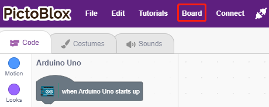

Για παράδειγμα, επιλέξτε **Arduino Mega**.

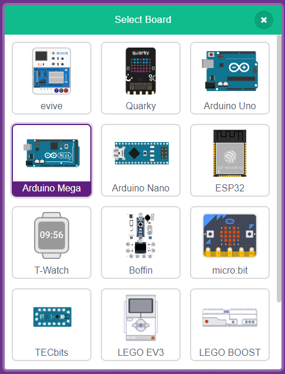

Στη συνέχεια θα εμφανιστεί ένα παράθυρο σύνδεσης για να επιλέξετε τη θύρα στην οποία θα συνδεθείτε και να επιστρέψετε στην αρχική σελίδα όταν ολοκληρωθεί η σύνδεση. Εάν διακόψετε τη σύνδεση κατά τη χρήση, μπορείτε επίσης να κάνετε κλικ στο **Connect** για να επανασυνδεθείτε.

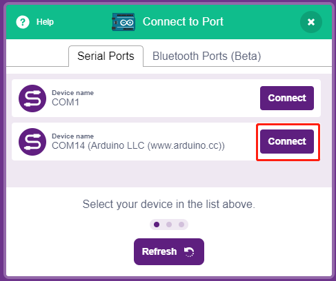

Ταυτόχρονα, οι παλέτες που σχετίζονται με το Arduino Mega, όπως το Arduino Mega, οι Actuators, κ.λ.π., θα εμφανιστούν στην **Παλέτα μπλοκ**.

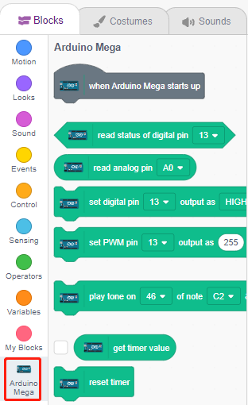

**2. Ανεβάστε το υλικολογισμικό (Firmware)**

Εφόσον πρόκειται να εργαστούμε στη λειτουργία Stage, πρέπει να ανεβάσουμε το υλικολογισμικό στον πίνακα. Θα εξασφαλίσει επικοινωνία σε πραγματικό χρόνο μεταξύ της πλακέτας και του υπολογιστή. Η μεταφόρτωση του υλικολογισμικού είναι μια διαδικασία εφάπαξ. Για να το κάνετε αυτό, κάντε κλικ στο κουμπί Upload Firmware.

Μετά από λίγη αναμονή, θα εμφανιστεί το μήνυμα επιτυχίας της μεταφόρτωσης.

.. note::

    Εάν χρησιμοποιείτε αυτή την πλακέτα Arduino στο PictoBlox για πρώτη φορά ή εάν αυτό το Arduino είχε μεταφορτωθεί προηγουμένως με το Arduino IDE: τότε, θα πρέπει να πατήσετε Upload Firmware για να μπορέσετε να το χρησιμοποιήσετε.

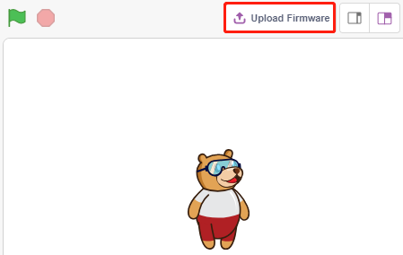

**3. Προγραμματισμός**

* Ανοίξτε και εκτελέστε απευθείας το σενάριο

Φυσικά, μπορείτε να ανοίξετε τα σενάρια απευθείας για να τα εκτελέσετε, αλλά παρακαλούμε να τα κατεβάσετε πρώτα από το `github <https://github.com/sunfounder/sunfounder_vincent_kit_for_arduino/archive/refs/heads/master.zip>`_.

Μπορείτε να κάνετε κλικ στο **File** στην επάνω δεξιά γωνία και στη συνέχεια να επιλέξετε **Open**.

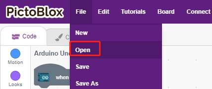

Επιλέξτε **Open from Computer**.

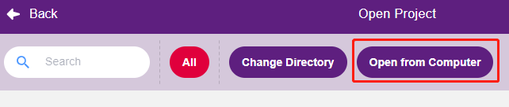

Στη συνέχεια, μεταβείτε στη διαδρομή του ``sunfounder_vincent_kit_for_arduino\scratch\code``, και ανοίξτε το **1. Stage Mode.sb3**. Βεβαιωθείτε ότι έχετε κατεβάσει τον απαιτούμενο κώδικα από το `github <https://github.com/sunfounder/sunfounder_vincent_kit_for_arduino/archive/refs/heads/master.zip>`_.

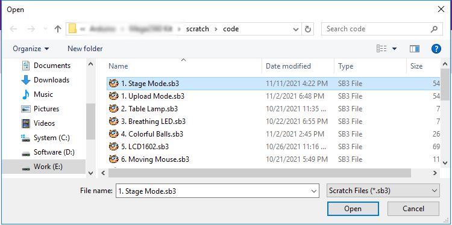

Κάντε κλικ απευθείας στο σενάριο για να το εκτελέσετε. ΣΕ ορισμένα έργα πρέπει να κάνετε κλικ στην πράσινη σημαία ή να κάνετε κλικ στη μορφή.

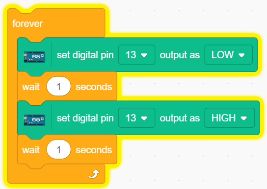

* Το πρόγραμμα βήμα-βήμα

Μπορείτε επίσης να γράψετε το σενάριο βήμα προς βήμα ακολουθώντας τα παρακάτω βήματα.

Κάντε κλικ στην παλέτα **Arduino Mega**.

The LED on the Arduino board is controlled by the digital pin 13 (only 2 states, HIGH or LOW), so drag the [set digital pin out as]  block to the script area.

Since the default state of the LED is lit, now set pin 13 to LOW and click on this block and you will see the LED go off.

Η λυχνία LED στην πλακέτα Arduino ελέγχεται από την ψηφιακή ακίδα 13 (μόνο 2 καταστάσεις, ΥΨΗΛΗ (HIGH) ή ΧΑΜΗΛΗ (LOW)), επομένως σύρετε το μπλοκ [set digital pin output as] στην περιοχή του σεναρίου.

Εφόσον η προεπιλεγμένη κατάσταση της λυχνίας LED είναι "αναμμένη", ρυθμίστε τώρα τον ακροδέκτη 13 σε LOW και στη συνέχεια κάντε κλικ σε αυτό το μπλοκ και θα δείτε το LED να σβήνει.

* [set digital pin output as]: Ρυθμίστε τους ψηφιακούς ακροδέκτες (2~13) σε επίπεδο (HIGH/LOW).

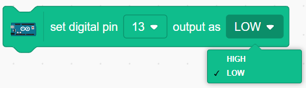

In order to see the effect of continuous blinking LED, you need to use the [Wait 1 seconds] and [forever] blocks in the **Control** palette. Click on these blocks after writing, there is a yellow halo means it is running.

* [Wait 1 seconds]: from the **Control** palette, used to set the time interval between 2 blocks.
* [forever]: from the **Control** palette, allows the script to keep running unless manually paused.

Λειτουργία Upload 
---------------

**1. Connect to Arduino Board**

Connect your Arduino board to the computer with a USB cable, usually the computer will automatically recognize your board and finally assign a COM port.

Open PictoBlox and click **Board** in the top right navigation bar to select the board.

For example, choose **Arduino Mega**.

A connection window will then pop up for you to select the port to connect to, and return to the home page when the connection is complete. If you break the connection during use, you can also click **Connect** to reconnect.

At the same time, Arduino Mega related palettes, such as Arduino Mega, Actuators, etc., will appear in the **Block Palette**.

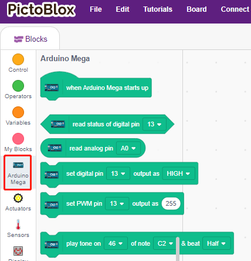

After selecting Upload mode, the stage will switch to the original Arduino code area.

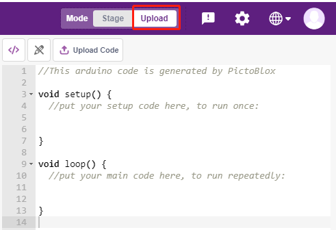

**2. Programming**

* Open and run the script directly

You can click on **File** in the top right corner.

Choose **Open from Computer**.

Then go to the path of ``sunfounder_vincent_kit_for_arduino\scratch\code``, and open **1. Upload Mode.sb3**. Please ensure that you have downloaded the required code from `github <https://github.com/sunfounder/sunfounder_vincent_kit_for_arduino/archive/refs/heads/master.zip>`_.

.. image:: img/0_upload.png

Finally, click the **Upload Code** button.

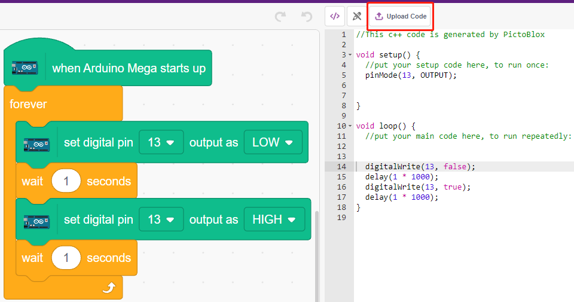

* Program step by step

You can also write the script step by step by following these steps.

Click on the **Arduino Mega** palette.

Drag [when Arduino Mega starts up] to the script area, which is required for every script.

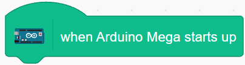

The LED on the Arduino board is controlled by the digital pin13 (only 2 states HIGH or LOW), so drag the [set digital pin out as]  block to the script area.

Since the default state of the LED is lit, now set pin 13 to LOW and click on this block and you will see the LED go off.

* [set digital pin out as]: Set the digital pin (2~13) to (HIGH/LOW) level.

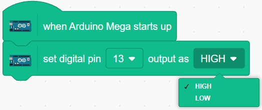

At this point you will see the Arduino code appear on the right side, if you want to edit this code, then you can turn Edit mode on.

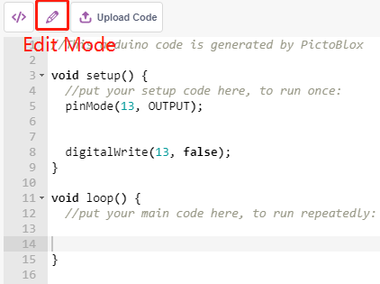

In order to see the effect of continuous blinking LED, you need to use the [Wait 1 seconds] and [forever] blocks in the **Control** palette. Click on these blocks after writing, there is a yellow halo means it is running.

* [Wait 1 seconds]: from the **Control** palette, used to set the time interval between 2 blocks.
* [forever]: from the **Control** palette, allows the script to keep running unless the power is off.

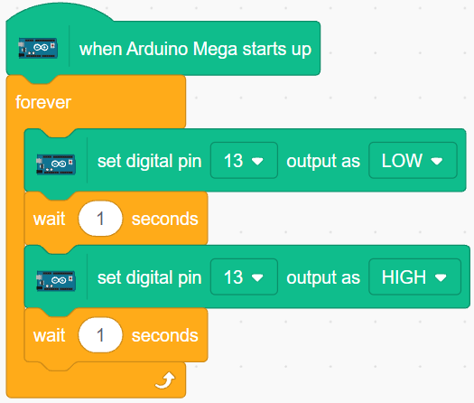

Finally, click the **Upload Code** button.

