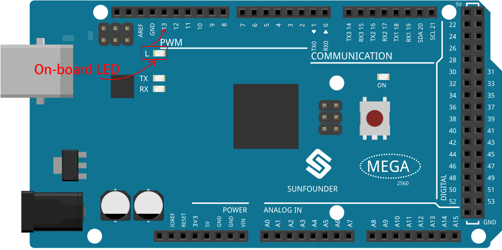

1.3 Γρήγορος Οδηγός για το PictoBlox
====================================

Ας μάθουμε τώρα πώς χρησιμοποιούμε το PictoBlox με τους 2 τρόπους λειτουργίας.

Επίσης, υπάρχει μια ενσωματωμένη λυχνία LED συνδεδεμένη με τον ακροδέκτη 13 στο Arduino Uno/Mega2560. Θα μάθουμε να κάνουμε αυτό το LED να αναβοσβήνει σε καθέναν από τους 2 τρόπους λειτουργίας.

Λειτουργία Stage
---------------

**1. Σύνδεση στην πλακέτα Arduino**

Συνδέστε την πλακέτα Arduino στον υπολογιστή με ένα καλώδιο USB. Συνήθως ο υπολογιστής αναγνωρίζει αυτόματα την πλακέτα σας και τελικά θα της εκχωρήσει μια θύρα COM.

Ανοίξτε το PictoBlox. Η διεπαφή προγραμματισμού Python θα ανοίξει από προεπιλογή και πρέπει να μεταβούμε στη διεπαφή Blocks.

.. image:: img/0_choose_blocks.png

Στη συνέχεια θα δείτε την επάνω δεξιά γωνία για εναλλαγή λειτουργίας. Η προεπιλογή είναι η λειτουργία Stage, όπου ο Tobi στέκεται στη σκηνή.

.. image:: img/1_stage_upload.png

Κάντε κλικ στο **Board** στην επάνω δεξιά γραμμή πλοήγησης για να επιλέξετε πλακέτα.

.. image:: img/1_board.png

Για παράδειγμα, επιλέξτε **Arduino Mega**.

.. image:: img/1_choose_mega.png

Στη συνέχεια θα εμφανιστεί ένα παράθυρο σύνδεσης για να επιλέξετε τη θύρα στην οποία θα συνδεθείτε και να επιστρέψετε στην αρχική σελίδα όταν ολοκληρωθεί η σύνδεση. Εάν διακόψετε τη σύνδεση κατά τη χρήση, μπορείτε επίσης να κάνετε κλικ στο **Connect** για να επανασυνδεθείτε.

Ταυτόχρονα, οι παλέτες που σχετίζονται με το Arduino Mega, όπως το Arduino Mega, οι Actuators, κ.λ.π., θα εμφανιστούν στην **Παλέτα μπλοκ**.

.. image:: img/1_arduino_mega.png

**2. Ανεβάστε το υλικολογισμικό (Firmware)**

Εφόσον πρόκειται να εργαστούμε στη λειτουργία Stage, πρέπει να ανεβάσουμε το υλικολογισμικό στην πλακέτα. Αυτό θα εξασφαλίσει την επικοινωνία σε πραγματικό χρόνο μεταξύ της πλακέτας και του υπολογιστή. Η μεταφόρτωση του υλικολογισμικού είναι μια διαδικασία εφάπαξ. Για να το κάνετε αυτό, κάντε κλικ στο κουμπί Upload Firmware.

Μετά από λίγο, θα εμφανιστεί το μήνυμα επιτυχίας της μεταφόρτωσης.

.. note::

    Εάν χρησιμοποιείτε αυτή την πλακέτα Arduino στο PictoBlox για πρώτη φορά ή εάν στην πλακέτα είχε μεταφορτωθεί προηγουμένως κώδικας του Arduino IDE: τότε, θα πρέπει να πατήσετε Upload Firmware για να μπορέσετε να τη χρησιμοποιήσετε.

.. image:: img/1_firmware.png

**3. Προγραμματισμός**

* Ανοίξτε και εκτελέστε απευθείας το σενάριο

Φυσικά, μπορείτε να ανοίξετε τα σενάρια απευθείας και να τα εκτελέσετε, αλλά προτείνουμε να τα κατεβάσετε πρώτα από το `github <https://github.com/sunfounder/sunfounder_vincent_kit_for_arduino/archive/refs/heads/master.zip>`_.

Μπορείτε να κάνετε κλικ στο **File** στην επάνω δεξιά γωνία και στη συνέχεια να επιλέξετε **Open**.

.. image:: img/0_open.png

Επιλέξτε **Open from Computer**.

.. image:: img/0_dic.png

Στη συνέχεια, μεταβείτε στη διαδρομή του ``sunfounder_vincent_kit_for_arduino\scratch\code``, και ανοίξτε το **1. Stage Mode.sb3**. Βεβαιωθείτε ότι έχετε κατεβάσει τον απαιτούμενο κώδικα από το `github <https://github.com/sunfounder/sunfounder_vincent_kit_for_arduino/archive/refs/heads/master.zip>`_.

.. image:: img/0_stage.png

Κάντε κλικ απευθείας στο σενάριο για να το εκτελέσετε. Σε ορισμένα έργα πρέπει να κάνετε κλικ στην πράσινη σημαία ή να κάνετε κλικ στη μορφή.

.. image:: img/1_more.png

* Το πρόγραμμα βήμα-βήμα

Μπορείτε επίσης να γράψετε το σενάριο βήμα προς βήμα ακολουθώντας τα παρακάτω βήματα.

Κάντε κλικ στην παλέτα **Arduino Mega**.

.. image:: img/1_arduino_mega.png

Η λυχνία LED στην πλακέτα Arduino ελέγχεται από την ψηφιακή ακίδα 13 (μόνο 2 καταστάσεις, ΥΨΗΛΗ (HIGH) ή ΧΑΜΗΛΗ (LOW)), επομένως σύρετε το μπλοκ [set digital pin output as] στην περιοχή του σεναρίου.

Εφόσον η προεπιλεγμένη κατάσταση της λυχνίας LED είναι "αναμμένη", ρυθμίστε τώρα τον ακροδέκτη 13 σε LOW και στη συνέχεια κάντε κλικ σε αυτό το μπλοκ και θα δείτε το LED να σβήνει.

* [set digital pin output as]: Ρυθμίστε τους ψηφιακούς ακροδέκτες (2~13) σε επίπεδο (HIGH/LOW).

.. image:: img/1_digital.png

Για να δείτε τη λυχνία LED να αναβοσβήνει συνεχόμενα, πρέπει να χρησιμοποιήσετε τα μπλοκ [Wait 1 seconds] και [forever] στην παλέτα Control. Αν κάνετε κλικ σε αυτά τα μπλοκ αφού γράψετε, θα εμφανιστεί ένα φωτεινό κίτρινο περίγραμμα που σημαίνει ότι το μπλοκ εκτελείται.

* [Wait 1 seconds]: από την παλέτα **Control**, χρησιμοποιείται για τον ορισμό του χρονικού διαστήματος παύσης μεταξύ 2 μπλοκ εντολ.
* [forever]: από την παλέτα **Control**, επιτρέπει στο σενάριο να συνεχίσει να εκτελείται εκτός και αν γίνει, μή αυτόματη, παύση.

.. image:: img/1_more.png

Λειτουργία Upload (Μεταφόρτωσης)
---------------

**1. Συνδεθείτε στην πλακέτα Arduino**

Συνδέστε την πλακέτα Arduino στον υπολογιστή με ένα καλώδιο USB, συνήθως ο υπολογιστής θα αναγνωρίσει αυτόματα την πλακέτα σας και τελικά θα της εκχωρήσει μια θύρα COM.

Ανοίξτε το PictoBlox και κάντε κλικ στο **Board** στην επάνω δεξιά γραμμή πλοήγησης για να επιλέξετε την πλακέτα σας.

.. image:: img/1_board.png

Για παράδειγμα, επιλέξτε **Arduino Mega**.

.. image:: img/1_choose_mega.png

Στη συνέχεια θα εμφανιστεί ένα παράθυρο σύνδεσης για να επιλέξετε τη θύρα στην οποία θα συνδεθείτε και να επιστρέψετε στην αρχική σελίδα όταν ολοκληρωθεί η σύνδεση. Εάν διακόψετε τη σύνδεση κατά τη χρήση της, μπορείτε να κάνετε ξανά κλικ στο **Connect** για να επανασυνδεθείτε.

Ταυτόχρονα, οι παλέτες που σχετίζονται με το Arduino Mega, όπως το Arduino Mega, οι Actuators, κ.λ.π., θα εμφανιστούν στην Παλέτα **Blocks**.

Αφού επιλέξετε τη λειτουργία Upload, το σκηνικό εναλλάσεται με την αρχική περιοχή κώδικα Arduino.

.. image:: img/1_upload.png

**2. Προγραμματισμός**

* Ανοίξτε και εκτελέστε απευθείας το σενάριο

Μπορείτε να κάνετε κλικ στο **File** στην επάνω δεξιά γωνία.

.. image:: img/0_open.png

Επιλέξτε **Open from Computer**.

.. image:: img/0_dic.png

Στη συνέχεια, μεταβείτε στη διαδρομή ``sunfounder_vincent_kit_for_arduino\scratch\code``, και ανοίξτε το **1. Upload Mode.sb3**. Βεβαιωθείτε ότι έχετε κατεβάσει τον απαιτούμενο κώδικα από το `github <https://github.com/sunfounder/sunfounder_vincent_kit_for_arduino/archive/refs/heads/master.zip>`_.

.. image:: img/0_upload.png

Τέλος, κάντε κλικ στο κουμπί **Upload Code**.

.. image:: img/1_upload_code.png

* Το πρόγραμμα βήμα-βήμα

Μπορείτε επίσης να γράψετε το σενάριο βήμα προς βήμα ακολουθώντας αυτά τα βήματα.

Κάντε κλικ στην παλέτα **Arduino Mega**.

Σύρετε το [when Arduino Mega starts up], το οποίο απαιτείται για κάθε σενάριο, στην περιοχή του σεναρίου.

.. image:: img/1_mega_starts.png

Η λυχνία LED στην πλακέτα Arduino ελέγχεται από την ψηφιακή ακίδα 13 (μόνο 2 καταστάσεις, ΥΨΗΛΗ (HIGH) ή ΧΑΜΗΛΗ (LOW)), επομένως σύρετε το μπλοκ [set digital pin output as] στην περιοχή του σεναρίου.

Εφόσον η προεπιλεγμένη κατάσταση της λυχνίας LED είναι "αναμμένη", ρυθμίστε τώρα τον ακροδέκτη 13 σε LOW και στη συνέχεια κάντε κλικ σε αυτό το μπλοκ και θα δείτε το LED να σβήνει.

* [set digital pin out as]: Ρυθμίστε τους ψηφιακούς ακροδέκτες (2~13) σε επίπεδο (HIGH/LOW).

.. image:: img/1_upload_digital.png

Σε αυτό το σημείο θα δείτε τον κωδικό Arduino να εμφανίζεται στη δεξιά πλευρά, εάν θέλετε να επεξεργαστείτε αυτόν τον κωδικό, τότε μπορείτε να ενεργοποιήσετε τη λειτουργία επεξεργασίας.

.. image:: img/1_upload1.png

Για να δείτε τη λυχνία LED να αναβοσβήνει συνεχόμενα, πρέπει να χρησιμοποιήσετε τα μπλοκ [Wait 1 seconds] και [forever] στην παλέτα Control. Αν κάνετε κλικ σε αυτά τα μπλοκ αφού γράψετε, θα εμφανιστεί ένα φωτεινό κίτρινο περίγραμμα που σημαίνει ότι το μπλοκ εκτελείται.

* [Wait 1 seconds]: από την παλέτα **Control**, χρησιμοποιείται για τον ορισμό του χρονικού διαστήματος παύσης μεταξύ 2 μπλοκ εντολ.
* [forever]: από την παλέτα **Control**, επιτρέπει στο σενάριο να συνεχίσει να εκτελείται εκτός και αν διακοπεί η παροχή ρεύματος.

.. image:: img/1_upload_more.png

Τέλος, κάντε κλικ στο κουμπί **Upload Code**.

.. image:: img/1_upload_code.png
